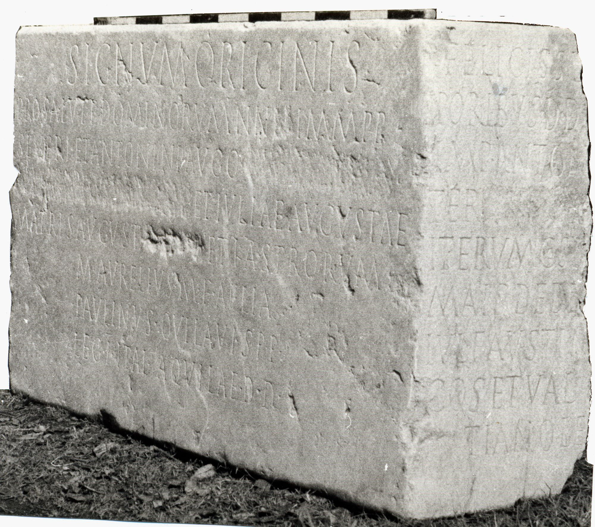

# EDH HD002125. Novae

**Країна.** Болгарія

**Провінція (код EDH).** MoI

**Місце знахідки (антична назва).** Novae

**Сучасна назва.** Svištov

**Деталі знахідки.** Lager, {Bischofsbasilika}, Fußbodenbelag, sekundär verwendet

**Координати.** 43.612861503,25.393652915

**Рік знахідки.** 1976

**Датування (роки, від'ємні до н. е.).** 208 … 

**Тип пам'ятки.** Statuenbasis

**Розміри (висота, ширина, глибина, см).** -83.0 × -139.0 × -47.0

## Текст (латинь, скорочення розкрито)

```
Signum originis / pro salute dominorum nn[[[n(ostrorum)]]] Immpp(eratorum) / Severi et Antonini Augg(ustorum) [[[et P(ubli) Septimi]]] / [[[Getae nob(ilissimi) Caesaris]]] et Iuliae Augustae / matris Augusti [[[et Caes(aris)]]] et kastrorum / M(arcus) Aurelius M(arci) f(ilius) Aelia / Paulinus Ovilavis p(rimus) p(ilus) / leg(ionis) I Ital(icae) Aquilae d(ono) d(edit) // Felicissi[mis tem]/poribus dd[d(ominorum) nnn(ostrorum)] / Imp(eratore) Anton[ino Aug(usto)] / ter [[et Geta Caes(are)]] / iterum co(n)s(ulibus) I[d(ibus)] / Mais dedi[cante] / Iul(io) Faustin[iano] / co(n)s(ulari) et Val(erio) Q[---]/tiano le[g(ato) leg(ionis)]
```

## Текст у вихідному записі

```
SIGNVM ORIGINIS / PRO SALVTE DOMINORVM NN[[[ ]]] IMMPP / SEVERI ET ANTONINI AVGG [[[ ]]] / [[[ ]]] ET IVLIAE AVGVSTAE / MATRIS AVGVSTI [[[ ]]] ET KASTRORVM / M AVRELIVS M F AELIA / PAVLINVS OVILAVIS P P / LEG I ITAL AQVILAE D D / / FELICISSI[ ] / PORIBVS DD[ ] / IMP ANTON[ ] / TER [[ ]] / ITERVM COS I[ ] / MAIS DEDI[ ] / IVL FAVSTIN[ ] / COS ET VAL Q[ ] / TIANO LE[ ]
```

## Література

AE 1982, 0849.
- L. Mrozewicz, Archeologia 28, 1977, 117-124; Zeichnung. - AE 1982.
- L. Mrozewicz, Archeologia 31, 1980, 101-112; fig. 1-5; fig. 6 (Zeichnung). - AE 1982.
- L. Mrozewicz, in: Novae - Sektor Zachodni 1976 (Poznań 1981) 128-130; ryc. 51-53. - AE 1982.
- AE 1993, 1362.
- ILBulg 268ter.
- ILNovae 028; Abb. 28 a-c; Abb. 28 d-e (Zeichnungen).
- IGLN 047; pl. 18 (Fotos u. Zeichnungen).
- J. Kolendo, Archeologia 44, 1993, 126.
- L. Mrozewicz, ZPE 95, 1995, 221-225. - AE 1993.
- PIR (2. Aufl.) I 304. #

## Фото



Джерело https://edh.ub.uni-heidelberg.de/edh/inschrift/HD002125, ліцензія CC BY-SA 4.0. Оригінальний XML в архіві сирі_дані/edh_xml.zip
