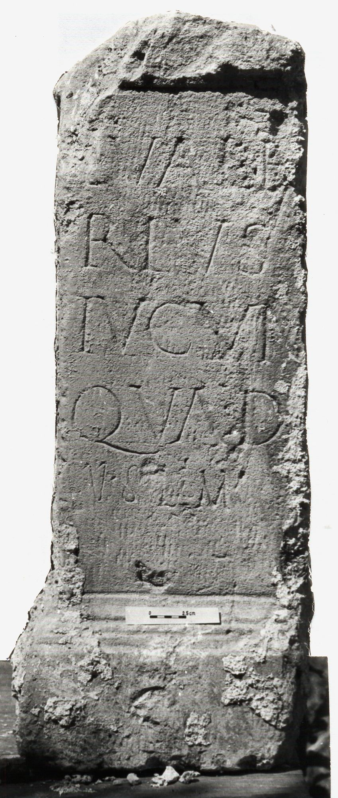

# EDH HD006331. Novae

**Країна.** Болгарія

**Провінція (код EDH).** MoI

**Місце знахідки (антична назва).** Novae

**Сучасна назва.** Svištov

**Деталі знахідки.** Lager, {Westtor}

**Координати.** 43.613766451,25.392274259

**Рік знахідки.** 1978

**Датування (роки, від'ємні до н. е.).** 101 … 250

**Матеріал.** Kalkstein

**Тип пам'ятки.** Altar

**Розміри (висота, ширина, глибина, см).** -52.0 × -19.0 × -17.0

## Текст (латинь, скорочення розкрито)

```
L(ucius) Vale/rius / Iucun(dus) / Quad(riviis) / v(otum) s(olvit) l(ibens) m(erito)
```

## Текст у вихідному записі

```
L VALE / RIVS / IVCVN / QVAD / V S L M
```

## Література

AE 1985, 0734.
- ILBulg 298bis.
- IGLN 042; pl. 16, 42.
- ILNovae 023; Abb. 23a; Abb. 23b (Zeichnung).
- L. Mrozewicz, Eos 73, 1985, 167-169; Foto. - AE 1985.
- L. Mrozewicz, Archeologia 31, 1980, 161; ryc. 3; ryc. 4 (Zeichnung). - AE 1985.
- L. Mrozewicz, in: Novae. Sektor Zachodni 1976, 1978 (Poznań 1981) 132, Nr. 3; ryc. 56. #

## Фото



Джерело https://edh.ub.uni-heidelberg.de/edh/inschrift/HD006331, ліцензія CC BY-SA 4.0. Оригінальний XML в архіві сирі_дані/edh_xml.zip
