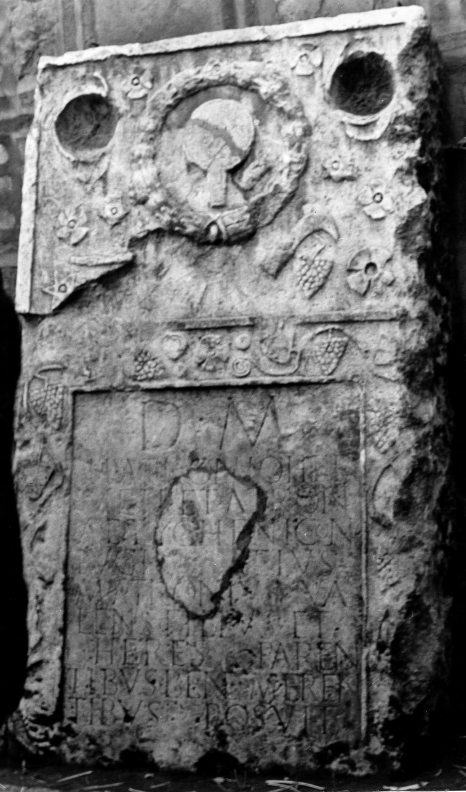

# EDH HD009266. Novae?

**Країна.** Болгарія

**Провінція (код EDH).** MoI

**Місце знахідки (антична назва).** Novae?

**Сучасна назва.** Svištov?

**Координати.** 43.618351,25.350622400

**Зберігання.** Sofija, Nac. Arh. Muz.

**Датування (роки, від'ємні до н. е.).** 101 … 150

**Матеріал.** Kalkstein

**Тип пам'ятки.** Stele

**Розміри (висота, ширина, глибина, см).** -198.0 × 112.0 × 31.0

## Текст (латинь, скорочення розкрито)

```
D(is) M(anibus) / M(arco) Atronio Her/meti et Atroni/ae Tycheni con/iugi eius / M(arcus) Atronius Va/lens filius et / heres paren/tibus bene meren/tibus posuit
```

## Текст у вихідному записі

```
D M / M ATRONIO HER / METI ET ATRONI / AE TYCHENI CON / IVGI EIVS / M ATRONIVS VA / LENS FILIVS ET / HERES PAREN / TIBVS BENE MEREN / TIBVS POSVIT
```

## Коментар

Oberhalb des Inschriftfeldes Kranz, Spiegel, Kamm und Rebmesser und mehrere Rosetten.

## Література

S. Conrad, Die Grabstelen aus Moesia inferior. Untersuchungen zu Chronologie, Typologie und Ikonographie (Leipzig 2004) 230-231, Nr. 388; Taf. 101, 5.
- ILBulg 326; tab. 61, 326.
- V. Božilova - J. Kolendo - L. Mrozewicz, Inscriptions latines de Novae (Poznań 1992) 92-93, Nr. 53; Fotos.
- ILNovae 053; Abb. 53a u. 53b.
- IGLN 094; pl. 33, 94. #

## Фото



Джерело https://edh.ub.uni-heidelberg.de/edh/inschrift/HD009266, ліцензія CC BY-SA 4.0. Оригінальний XML в архіві сирі_дані/edh_xml.zip
