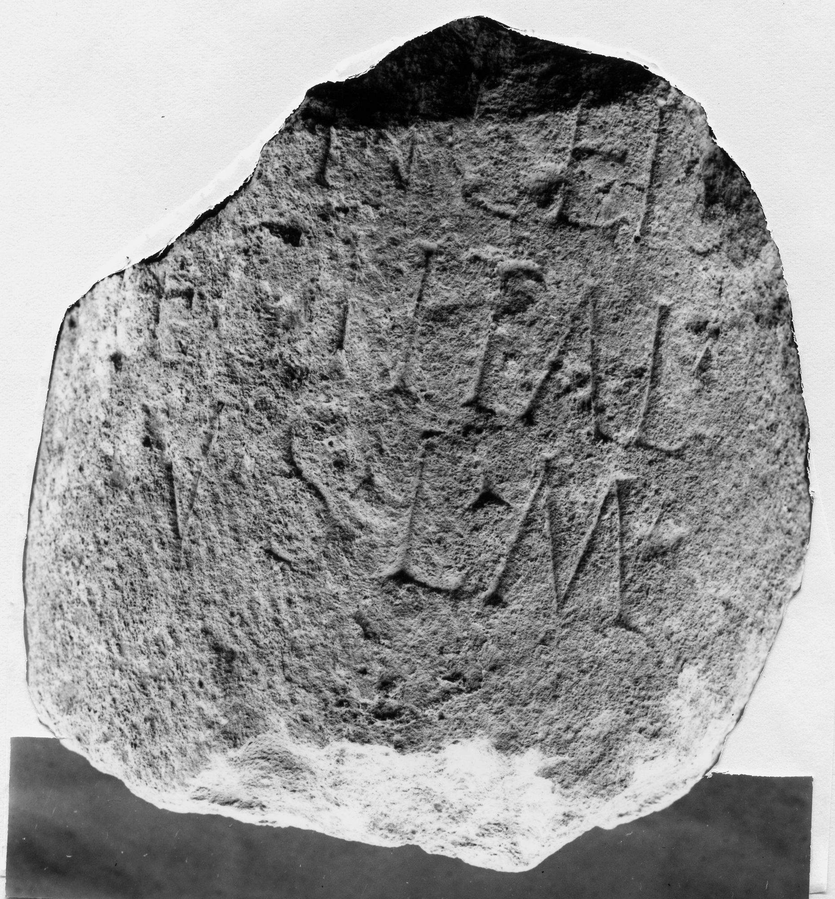

# EDH HD009859. Novae

**Країна.** Болгарія

**Провінція (код EDH).** MoI

**Місце знахідки (антична назва).** Novae

**Сучасна назва.** Svištov

**Деталі знахідки.** Lager, {moderne Straße, südlich}

**Координати.** 43.613296501,25.392944811

**Рік знахідки.** 1967

**Датування (роки, від'ємні до н. е.).** 69 … 100

**Матеріал.** Gesteine

**Тип пам'ятки.** Architekturteil

**Розміри (висота, ширина, глибина, см).** -26.0 × 26.0

## Текст (латинь, скорочення розкрито)

```
$ pri]nceps / leg(ionis) I Ital(icae) / v(otum) s(olvit) l(ibens) m(erito)
```

## Текст у вихідному записі

```
]NCEPS / LEG I ITAL / V S L M
```

## Коментар

Säule.

## Література

AE 1972, 0527.
- AE 1968, 0454bis.
- ILBulg 299.
- ILNovae 031; Abb. 31.
- IGLN 050; pl. 20, 50 (Foto u. Zeichnung).
- K. Majewski, Latomus 27, 1968, 432; pl. 20, 7. - AE 1968.
- L. Press - Z. Sochacki - Z. Tabasz - J. Kolendo, Archeologia 20, 1969, 166 u. 168; ryc. 114; ryc. 115 (Zeichnung). - AE 1972. #

## Фото



Джерело https://edh.ub.uni-heidelberg.de/edh/inschrift/HD009859, ліцензія CC BY-SA 4.0. Оригінальний XML в архіві сирі_дані/edh_xml.zip
