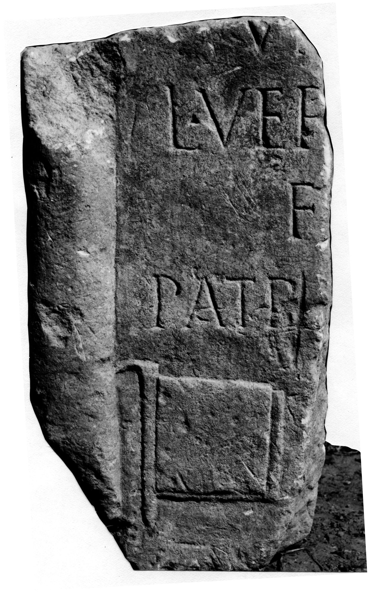

# EDH HD009865. Novae

**Країна.** Болгарія

**Провінція (код EDH).** MoI

**Місце знахідки (антична назва).** Novae

**Сучасна назва.** Svištov

**Деталі знахідки.** Lager, {valetudinarium}, westlich

**Координати.** 43.614318118,25.393785174

**Рік знахідки.** 1968

**Зберігання.** Novae, Lap.

**Датування (роки, від'ємні до н. е.).** 101 … 200

**Матеріал.** Kalkstein

**Тип пам'ятки.** Stele

**Розміри (висота, ширина, глибина, см).** -63.0 × -35.0 × 30.0

## Текст (латинь, скорочення розкрито)

```
$] / vi[x(it) ---] / L(ucius) Ver[---] / f[---] / patri [---]
```

## Текст у вихідному записі

```
] / VI[ ] / L VER[ ] / F[ ] / PATRI [ ]
```

## Коментар

Z. 3: ILBulg: f(aciendum) [c(uravit)]; Parnicki, AE 1972, ILNovae, IGLNovae: f[ilius].

## Література

AE 1972, 0529.
- S. Conrad, Die Grabstelen aus Moesia inferior. Untersuchungen zu Chronologie, Typologie und Ikonographie (Leipzig 2004) 237, Nr. 412; Taf. 129, 5.
- ILBulg 330.
- ILNovae 060; Abb. 60.
- S. Parnicki u. a., Archeologia 21, 1970, 198, Nr. 1; ryc 110. - AE 1972.
- IGLN 110; pl. 37, 110. #

## Фото



Джерело https://edh.ub.uni-heidelberg.de/edh/inschrift/HD009865, ліцензія CC BY-SA 4.0. Оригінальний XML в архіві сирі_дані/edh_xml.zip
