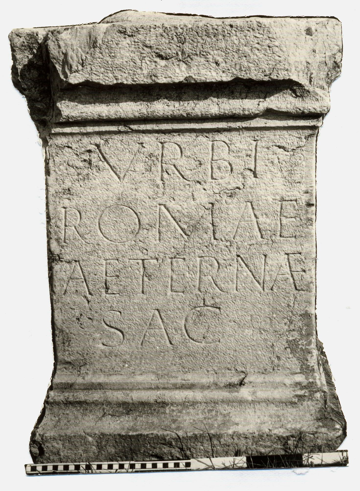

# EDH HD011868. Novae

**Країна.** Болгарія

**Провінція (код EDH).** MoI

**Місце знахідки (антична назва).** Novae

**Сучасна назва.** Svištov

**Деталі знахідки.** Lager, {principia, Innenhof}

**Координати.** 43.613042105,25.394527313

**Рік знахідки.** 1972

**Датування (роки, від'ємні до н. е.).** 140 … 150

**Матеріал.** Gesteine

**Тип пам'ятки.** Altar

**Розміри (висота, ширина, глибина, см).** 85.0 × 58.0 × 56.0

## Текст (латинь, скорочення розкрито)

```
Urbi / Romae / aeternae / sac(rum)
```

## Текст у вихідному записі

```
VRBI / ROMAE / AETERNAE / SAC
```

## Література

AE 1975, 0755.
- ILBulg 298.
- J. Kolendo, in: S. Parnicki-Pudełko, Novae - Sektor Zachodni 1972 (Poznań 1975) 208-211 u. 292; ryc. 135. - AE 1975.
- IGLN 045; pl. 17, 45.
- ILNovae 026; Abb. 26.
- AE 2000, 1267.
- E. Bunsch, Novensia 12, 2000, 7-21; fig. 1. 4. 6. 7-9. 11; fig. 2 u. 3. 5 u. 10 (Zeichnungen). - AE 2000. #

## Фото



Джерело https://edh.ub.uni-heidelberg.de/edh/inschrift/HD011868, ліцензія CC BY-SA 4.0. Оригінальний XML в архіві сирі_дані/edh_xml.zip
