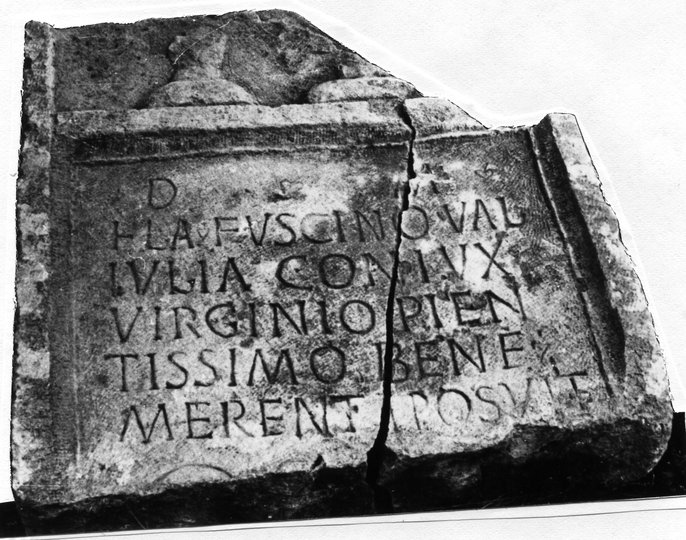

# EDH HD012740. Novae

**Країна.** Болгарія

**Провінція (код EDH).** MoI

**Місце знахідки (антична назва).** Novae

**Сучасна назва.** Svištov

**Деталі знахідки.** Lager, westlich, {spätantikes Grab}, sekundär verwendet

**Координати.** 43.613335341,25.390396714

**Рік знахідки.** 1975

**Зберігання.** Novae, Lap.

**Датування (роки, від'ємні до н. е.).** 101 … 200

**Матеріал.** Kalkstein

**Тип пам'ятки.** Stele

**Розміри (висота, ширина, глибина, см).** -92.0 × 90.0 × 22.0

## Текст (латинь, скорочення розкрито)

```
D(is) M(anibus) / Fla(vio) Fuscino Val(eria) / Iulia coniux / virginio pien/tissimo bene / merenti posuit
```

## Текст у вихідному записі

```
D M / FLA FVSCINO VAL / IVLIA CONIVX / VIRGINIO PIEN / TISSIMO BENE / MERENTI POSVIT
```

## Коментар

(B): Z. 2: Božilova, AE 1987: Flav(io).

## Література

AE 1987, 0864. (B)
- ILNovae 057; Abb. 57.
- S. Conrad, Die Grabstelen aus Moesia inferior. Untersuchungen zu Chronologie, Typologie und Ikonographie (Leipzig 2004) 233, Nr. 397; Taf. 109, 1.
- IGLN 096; pl. 34, 96.
- V. Božilova, in: A. Fol - V. Zhivkov - N. Nedjalkov (Hrsg.), Acta Centri Historiae Terra Antiqua Balcanica 2, Sofia 1987 (Sofia 1987) 225. 227-228; fig. 2. (B) - AE 1987.
- AE 2006, 1203.
- J. Kolendo, Archeologia 57, 2006, 164, Nr. 12. - AE 2006. #

## Фото



Джерело https://edh.ub.uni-heidelberg.de/edh/inschrift/HD012740, ліцензія CC BY-SA 4.0. Оригінальний XML в архіві сирі_дані/edh_xml.zip
