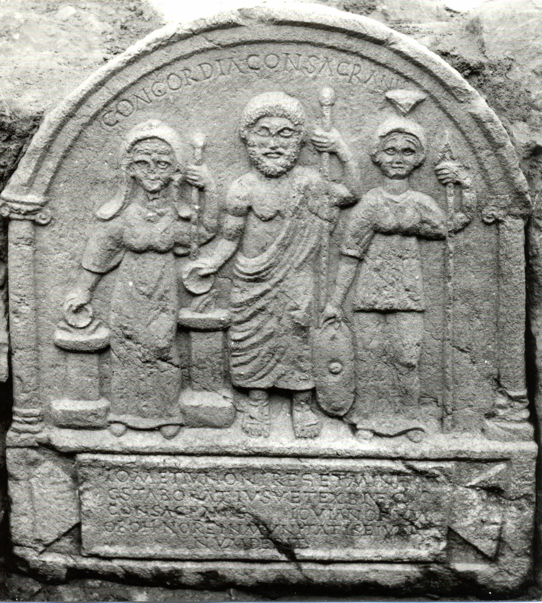

# EDH HD016006. Novae

**Країна.** Болгарія

**Провінція (код EDH).** MoI

**Місце знахідки (антична назва).** Novae

**Сучасна назва.** Svištov

**Деталі знахідки.** Lager, valetudinarium, über, "Portikusvilla", über, {spätantikes Gebäude}

**Координати.** 43.614558915,25.393774445

**Рік знахідки.** 1960

**Зберігання.** Veliko Tŭrnovo, Arh. Muz.

**Датування (роки, від'ємні до н. е.).** 201 … 211

**Матеріал.** Gesteine

**Тип пам'ятки.** Relief

**Розміри (висота, ширина, глибина, см).** 94.0 × 83.0 × 15.0

## Текст (латинь, скорочення розкрито)

```
Concordia consacranis // I(ovi) O(ptimo) M(aximo) et Iunoni Reg(inae) et Minervae / C(aius) Staboratius vet(eranus) ex b(e)n(e)f(iciario) co(n)s(ularis) / consacranis Iovianorum / ob ohnore(m)(!) inmunitatis eius do/num dedit
```

## Текст у вихідному записі

```
CONCORDIA CONSACRANIS / / I O M ET IVNONI REG ET MINERVAE / C STABORATIVS VET EX BNF COS / CONSACRANIS IOVIANORVM / OB OHNORE INMVNITATIS EIVS DO / NVM DEDIT
```

## Коментар

(B): Z. 2: ILBulg, Schallmayer, AE 1991: Mine[rva]e; Z. 3 Ende: IGLNovae: c(onsularis), ILNovae: c(onsulari), ILBulg, Kolendo - Sultov 1991, Schallmayer, AE 1991: c[o(n)s(ularis)]; Z. 5/6: ILNovae: eius DC / num(mum); ILBulg: eiu[s]d(em) / num(inibus) de[orum?]; Schallmayer: eiu[s do]/num. AE 1964, 180bis: lediglich die erste Zeile wiedergegeben.

## Література

AE 1964, 0180bis. (B)
- AE 1991, 1370. (B)
- IGLN 024; pl. 8, 24. (B)
- ILNovae 012; Abb. 12 a u. b. (B)
- ILBulg 273. (B)
- K. Majewski, Klio 39, 1961, 319. - AE 1964.
- J. Kolendo, Archeologia 44, 1993, 126.
- J. Kolendo, Archeologia 16, 1965, 122, Nr. 3, Anm. 34.
- J. Kolendo - B. Sultov, Eos 75, 1987, 369-379; fog. 1 u. 2. - AE 1991.
- J. Kolendo - B. Sultov, Novensia 2, 1991, 33-44; fig. 1-3. (B) - AE 1991.
- E. Schallmayer - K. Eibl - J. Ott - G. Preuß - E. Wittkopf, Der römische Weihebezirk von Osterburken 1 (Stuttgart 1990) 503-504, Nr. 653; Foto. - AE 1991. #

## Фото



Джерело https://edh.ub.uni-heidelberg.de/edh/inschrift/HD016006, ліцензія CC BY-SA 4.0. Оригінальний XML в архіві сирі_дані/edh_xml.zip
