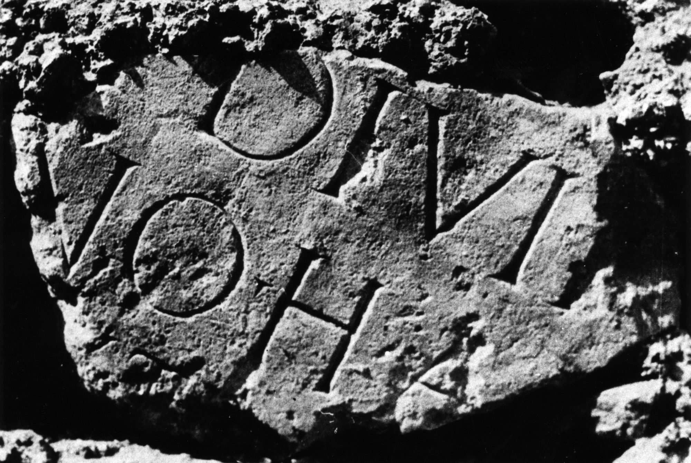

# EDH HD016027. Novae

**Країна.** Болгарія

**Провінція (код EDH).** MoI

**Місце знахідки (антична назва).** Novae

**Сучасна назва.** Svištov

**Деталі знахідки.** {Lager, Nordwestecke}, sekundär verwendet

**Координати.** 43.614997626,25.392462014

**Рік знахідки.** 1962

**Зберігання.** Svištov, Ist. Muz.

**Датування (роки, від'ємні до н. е.).** 117 … 138

**Матеріал.** Kalkstein

**Тип пам'ятки.** Tafel?

**Розміри (висота, ширина, глибина, см).** -26.0 × -43.0

## Текст (латинь, скорочення розкрито)

```
[Imp(eratori) Caes(ari) divi Traiani] / [Parth(ici) f(ilio)] divi N[ervae nep(oti)] / [Traia]no Ha[driano Aug(usto)] / [pontif(ici) ma]x(imo) tr(ibunicia) p[ot(estate) --- co(n)s(uli) ---]
```

## Текст у вихідному записі

```
[ ] / [ ] DIVI N[ ] / [ ]NO HA[ ] / [ ]X TR P[ ]
```

## Коментар

Textwiedergabe / Ergänzungen nach IGLNovae.

## Література

AE 1964, 0187.
- ILBulg 265.
- ILNovae 034; Abb. 34 a; Abb. 34 b (Zeichnung).
- IGLN 053; pl. 21, 53.
- K. Majewski, Latomus 22, 1963, 504; pl. 53, 2. (B) - AE 1964.
- AE 1966, 0348.
- J. Kolendo - J. Trynkowski, Archeologia 16, 1965, 122, Nr. 4; fig. 4; fig. 5 (Zeichnung). - AE 1966. #

## Фото



Джерело https://edh.ub.uni-heidelberg.de/edh/inschrift/HD016027, ліцензія CC BY-SA 4.0. Оригінальний XML в архіві сирі_дані/edh_xml.zip
