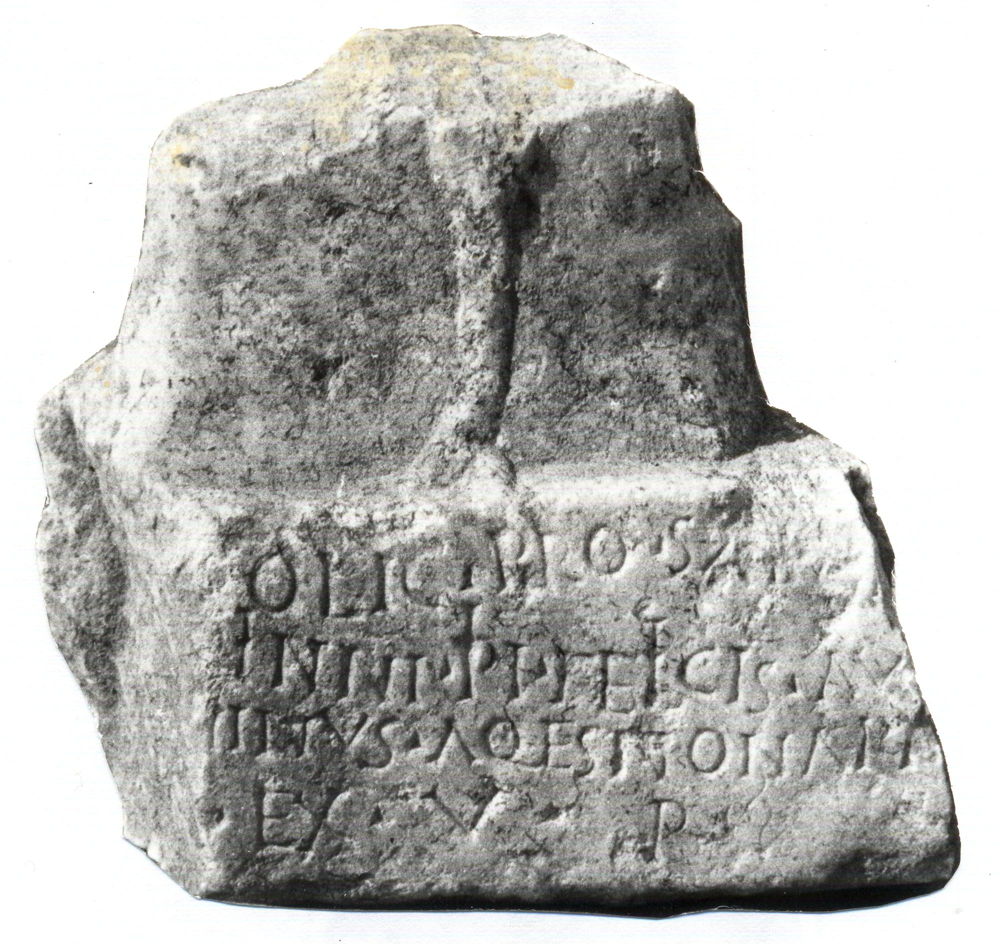

# EDH HD016262. Novae

**Країна.** Болгарія

**Провінція (код EDH).** MoI

**Місце знахідки (антична назва).** Novae

**Сучасна назва.** Svištov

**Деталі знахідки.** Lager, valetudinarium, über, {"Portikusvilla", Bad}

**Координати.** 43.614219080,25.393862959

**Рік знахідки.** 1962

**Зберігання.** Svištov, Ist. Muz.

**Датування (роки, від'ємні до н. е.).** 186 … 222

**Матеріал.** Gesteine

**Тип пам'ятки.** Altar

**Розміри (висота, ширина, глибина, см).** -25.0 × -29.0 × -11.0

## Текст (латинь, скорочення розкрито)

```
[Iovi Optimo Maximo D]olic(heno) pro salu[te] / [Imp(eratoris) Caes(aris) M(arci) Aureli Anto]ni{n}ni Pii Felicis Aug(usti) / [---]ninus a q(ua)estionari[is] / [leg(ionis) ---] ex v(oto) p(osuit)
```

## Текст у вихідному записі

```
[ ]OLIC PRO SALV[ ] / [ ]NINNI PII FELICIS AVG / [ ]NINVS A QESTIONARI[ ] / [ ] EX V P
```

## Література

AE 1966, 0346.
- ILBulg 276.
- IGLN 026; pl. 11, 26.
- J. Kolendo - J. Trynkowski, Archeologia 16, 1965, 115-121, Nr. 1; fig. 1; fig. 2 (Zeichnung). - AE 1966.
- CCID 075; Taf. 20, 75.
- ILNovae 014; Abb. 14 a; Abb. 14 b (Zeichnung). #

## Фото



Джерело https://edh.ub.uni-heidelberg.de/edh/inschrift/HD016262, ліцензія CC BY-SA 4.0. Оригінальний XML в архіві сирі_дані/edh_xml.zip
