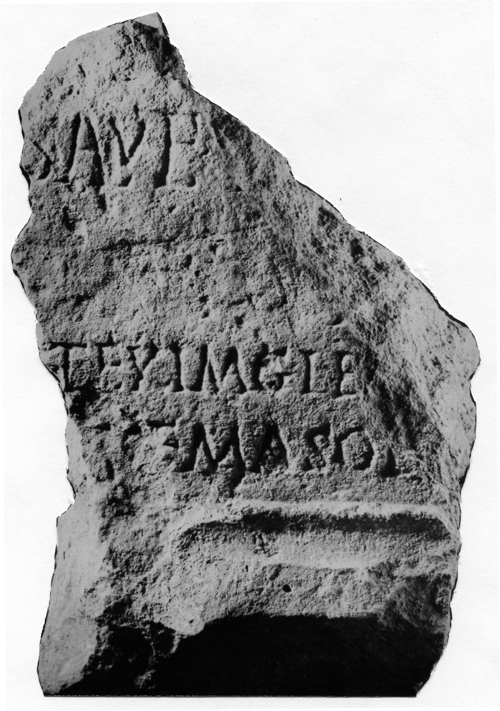

# EDH HD016265. Novae

**Країна.** Болгарія

**Провінція (код EDH).** MoI

**Місце знахідки (антична назва).** Novae

**Сучасна назва.** Svištov

**Деталі знахідки.** Lager, valetudinarium, über, {"Portikusvilla", Raum K}

**Координати.** 43.614568625,25.393667157

**Рік знахідки.** 1960

**Датування (роки, від'ємні до н. е.).** 222 … 235

**Матеріал.** Gesteine

**Тип пам'ятки.** Altar?

**Розміри (висота, ширина, глибина, см).** -36.5 × -12.5

## Текст (латинь, скорочення розкрито)

```
[I(ovi) O(ptimo) M(aximo)? et dis deabusque] / omnib(us) p[ro] salute I[[[mp(eratoris) Severi?]]] / [[[Alexandri Augusti?]]] / C(aius) Val(erius) Longinus v[e]t(eranus) ex imag(inifero) le[g(ionis) I Ital(icae) et ---] / Vale(n)s vet(eranus) ex c(ustode) a(rmorum) leg(ionis) s(upra) [s(criptae) ---]tem(?) a sol[o restituerunt?]
```

## Текст у вихідному записі

```
[ ] / OMNIB P[ ] SALVTE I[[[ ]]] / [[[ ]]] / C VAL LONGINVS V[ ]T EX IMAG LE[ ] / VALES VET EX C A LEG S [ ]TEM A SOL[ ]
```

## Коментар

Zwei aneinander passende Fragmente bekannt. Das linke Fragment wurde erst 1997 gefunden; Abmessungen: 40,4 x 44,2 x 15,8. Abmessungen des rechten Fragments: s. o. Gesamtabmessungen: -40,5 x -66,3 x 15,8.

## Література

AE 1966, 0347.
- ILBulg 277.
- J. Kolendo - J. Trynkowski, Archeologia 16, 1965, 121-122, Nr. 2; fig. 3. - AE 1966.
- IGLN 064; pl. 24, 64.
- ILNovae 043; Abb. 43.
- AE 2004, 1244.
- E. Bunsch - J. Kolendo - J. Żelazowski, Archeologia 54, 2003, 50-56, Nr. 2; fig. 2 (Zeichnung); pl. 13, 2. - AE 2004. #

## Фото



Джерело https://edh.ub.uni-heidelberg.de/edh/inschrift/HD016265, ліцензія CC BY-SA 4.0. Оригінальний XML в архіві сирі_дані/edh_xml.zip
