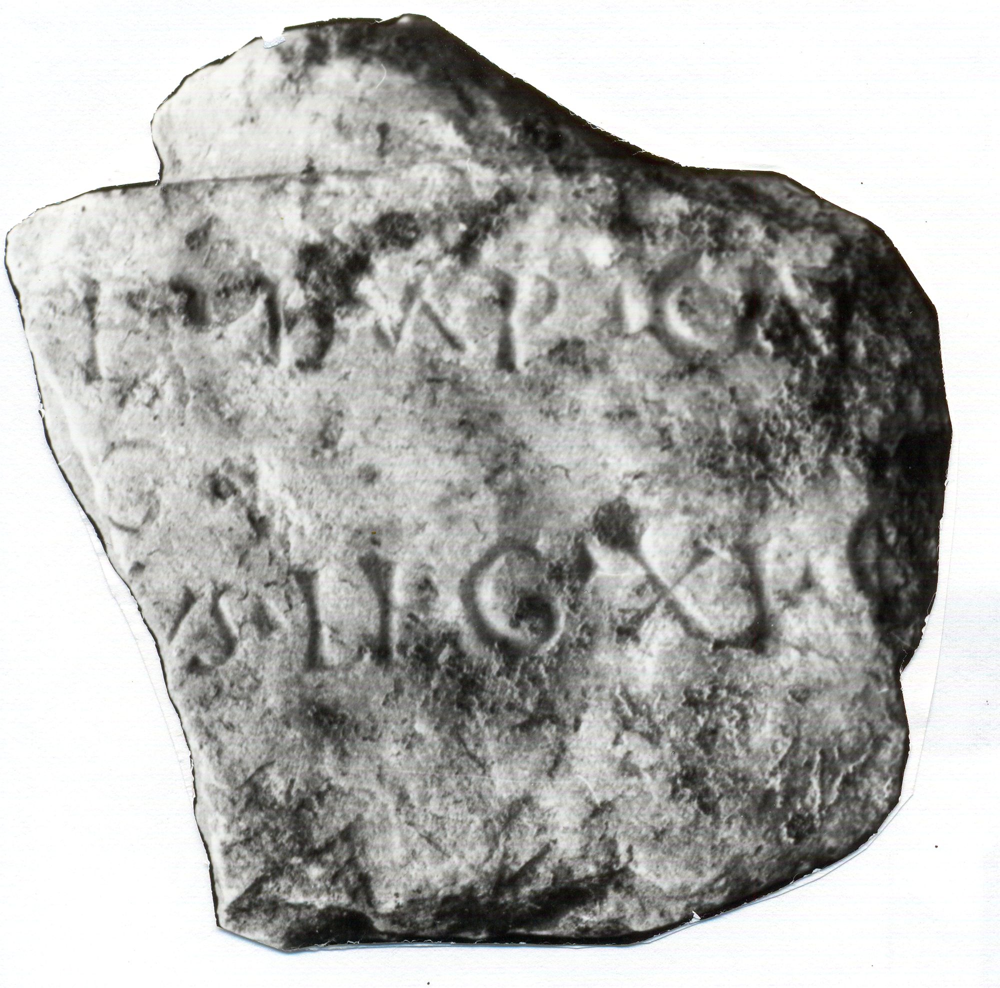

# EDH HD017569. Novae

**Країна.** Болгарія

**Провінція (код EDH).** MoI

**Місце знахідки (антична назва).** Novae

**Сучасна назва.** Svištov

**Деталі знахідки.** {spätantike Erweiterung}

**Координати.** 43.612170160,25.398518441

**Рік знахідки.** 1963

**Датування (роки, від'ємні до н. е.).** 151 … 250

**Матеріал.** Gesteine

**Тип пам'ятки.** Relief?

**Розміри (висота, ширина, глибина, см).** -16.5 × -15.0 × 3.9

## Текст (латинь, скорочення розкрито)

```
[I(ovi) O(ptimo) M(aximo) D(olicheno) pro salu]te Imp(eratoris) Caes(aris) / [--- Au]g(usti) / [--- veteran]us leg(ionis) XI C(laudiae)
```

## Текст у вихідному записі

```
[ ]TE IMP CAES / [ ]G / [ ]VS LEG XI C
```

## Коментар

(B): geringfügig abweichende Textwiedergaben.

## Література

AE 1965, 0136. (B)
- ILBulg 297. (B)
- D. P. Dimitrow - M. Tschitschikowa - B. Sultow - A. Dimitrowa, BIAB 28, 1965, 57, Nr. 5; fig. 22. - AE 1965.
- AE 2001, 1733.
- ILNovae 015; Abb. 15 a u. b.
- IGLN 028; pl. 11, 28.
- J. Kolendo, Archeologia 44, 1993, 128.
- V. Božilova, in: Studia in memoriam Velizari Velkov, Thracia 13 (Serdicae 2000) 41-42. - AE 2001. #

## Фото



Джерело https://edh.ub.uni-heidelberg.de/edh/inschrift/HD017569, ліцензія CC BY-SA 4.0. Оригінальний XML в архіві сирі_дані/edh_xml.zip
