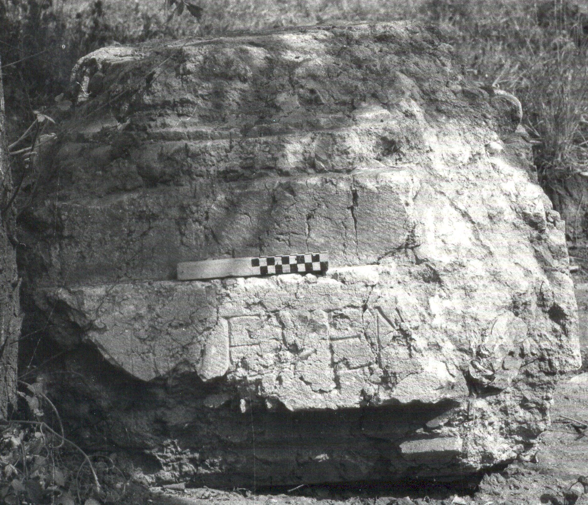

# EDH HD018390. Novae

**Країна.** Болгарія

**Провінція (код EDH).** MoI

**Місце знахідки (антична назва).** Novae

**Сучасна назва.** Svištov

**Деталі знахідки.** Lager, {principia, Frontporticus}, westlich

**Координати.** 43.613333397,25.394116934

**Рік знахідки.** 1975

**Датування (роки, від'ємні до н. е.).** 201 … 230

**Матеріал.** Gesteine

**Тип пам'ятки.** Statuenbasis

**Розміри (висота, ширина, глибина, см).** -65.0 × -95.0 × 85.0

## Текст (латинь, скорочення розкрито)

```
[Bo]no Even[tui]
```

## Текст у вихідному записі

```
[ ]NO EVEN[ ]
```

## Література

AE 1989, 0634.
- J. Kolendo, Archeologia 39, 1988, 102-103, Nr. 4; fig. 5 (Zeichnung). - AE 1989.
- ILNovae 003; Abb. 3 a u. c; Abb. 3 b (Zeichnung).
- IGLN 005; pl. 2, 5 (Fotos u. Zeichnungen).
- A. B. Biernacki - L. Mrozewicz, Eos 75, 1987, 129-140; fig. 2-5; fig. 9; fig. 6-8 (Zeichnungen). - AE 1989. #

## Фото



Джерело https://edh.ub.uni-heidelberg.de/edh/inschrift/HD018390, ліцензія CC BY-SA 4.0. Оригінальний XML в архіві сирі_дані/edh_xml.zip
