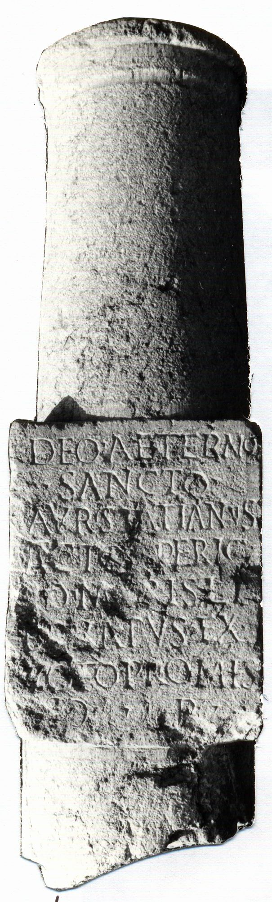

# EDH HD018393. Novae

**Країна.** Болгарія

**Провінція (код EDH).** MoI

**Місце знахідки (антична назва).** Novae

**Сучасна назва.** Svištov

**Деталі знахідки.** spätantike Erweiterung, {Lager, bei}, sekundär verwendet

**Координати.** 43.611533184,25.397611855

**Рік знахідки.** 1986

**Датування (роки, від'ємні до н. е.).** 151 … 250

**Матеріал.** Gesteine

**Тип пам'ятки.** EhrenVotivsäule

**Розміри (висота, ширина, глибина, см).** 110.0 × 31.0

## Текст (латинь, скорочення розкрито)

```
Deo Aeterno / Sancto / Aur(elius) Statianus / acto[r] pericu/[l]o maris li/b[e]ratus ex / voto promis/[s]o r(estituit)
```

## Текст у вихідному записі

```
DEO AETERNO / SANCTO / AVR STATIANVS / ACTO[ ] PERICV / [ ]O MARIS LI / B[ ]RATVS EX / VOTO PROMIS / [ ]O R
```

## Література

AE 1989, 0635.
- V. Božilova - L. Mrozewicz, ZPE 78, 1989, 178-179, Nr. 1; Taf. 11b; Zeichnungen. - AE 1989.
- IGLN 008; pl. 3, 8.
- ILNovae 004; Abb. 4 a; Abb. 4 b (Zeichnungen). #

## Фото



Джерело https://edh.ub.uni-heidelberg.de/edh/inschrift/HD018393, ліцензія CC BY-SA 4.0. Оригінальний XML в архіві сирі_дані/edh_xml.zip
