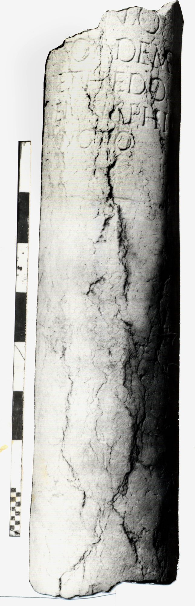

# EDH HD018399. Novae

**Країна.** Болгарія

**Провінція (код EDH).** MoI

**Місце знахідки (антична назва).** Novae

**Сучасна назва.** Svištov

**Деталі знахідки.** Lager, {Bischofsbasilika}

**Координати.** 43.612861502,25.393722651

**Рік знахідки.** 1984

**Датування (роки, від'ємні до н. е.).** 101 … 200

**Матеріал.** Gesteine

**Тип пам'ятки.** Architekturteil

**Розміри (висота, ширина, глибина, см).** -112.0 × 31.0

## Текст (латинь, скорочення розкрито)

```
$?] / [---]NO / Nestor Deme/tri et Hedo/ne Nymphi / ex voto
```

## Текст у вихідному записі

```
] / [ ]NO / NESTOR DEME / TRI ET HEDO / NE NYMPHI / EX VOTO
```

## Коментар

Säule.

## Література

AE 1989, 0637.
- IGLN 048; pl. 19, 48 (Fotos u. Zeichnung).
- ILNovae 021; Abb. 21 a u. b; Abb. 21 c (Zeichnung).
- L. Mrozewicz, Archeologia 39, 1988, 178, Nr. 6; ryc. 62; ryc. 63 (Zeichnung). - AE 1989. #

## Фото



Джерело https://edh.ub.uni-heidelberg.de/edh/inschrift/HD018399, ліцензія CC BY-SA 4.0. Оригінальний XML в архіві сирі_дані/edh_xml.zip
