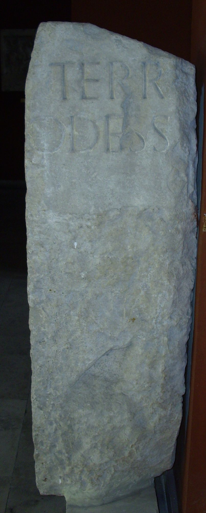
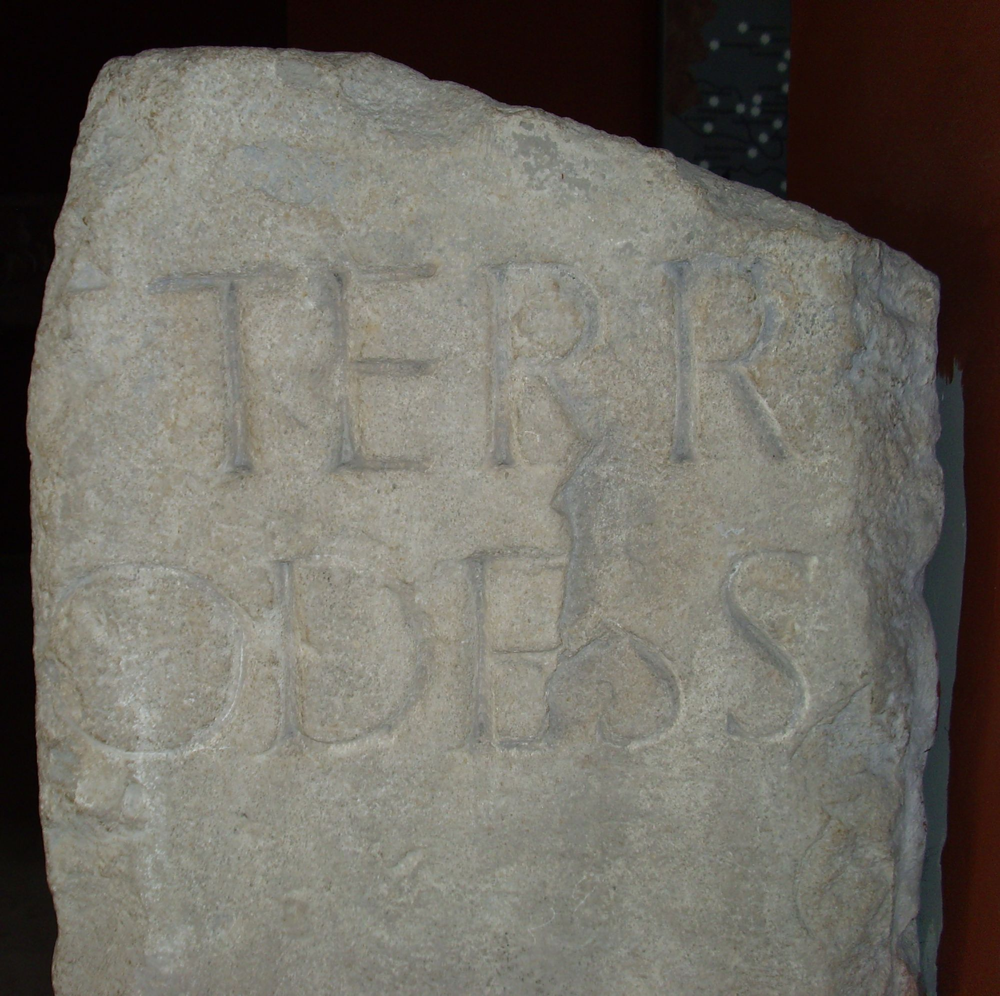
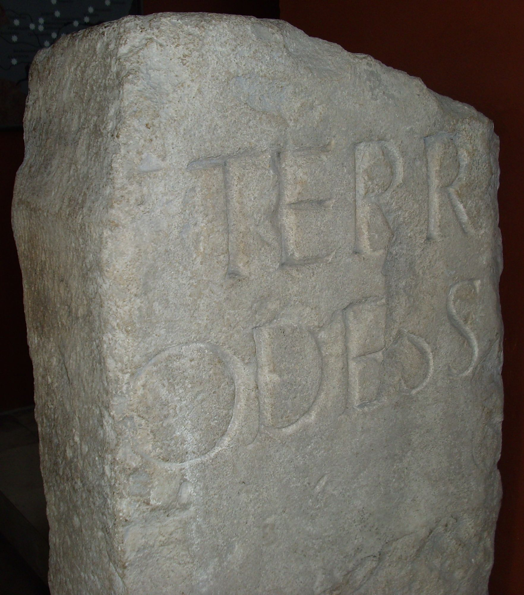
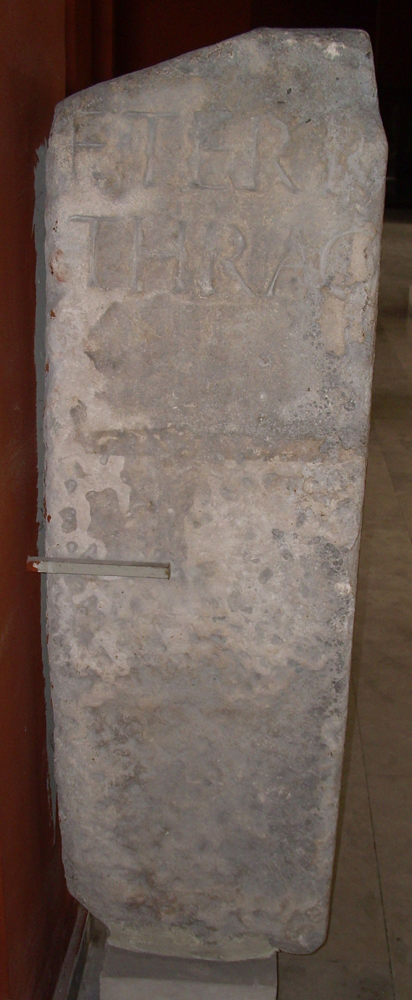

# EDH HD023791. Marcianopolis

**Країна.** Болгарія

**Провінція (код EDH).** MoI

**Місце знахідки (антична назва).** Marcianopolis

**Сучасна назва.** Devnja

**Координати.** 43.225044015,27.587581872

**Датування (роки, від'ємні до н. е.).** 180 … 192

**Тип пам'ятки.** Cippus

## Текст (латинь, скорочення розкрито)

```
F(ines) terr(ae) / Thrac(um) // F(ines) terr(ae) / Odess(itanorum)
```

## Текст у вихідному записі

```
F TERR / THRAC / / F TERR / ODESS
```

## Коментар

Z. 1-2 befinden sich auf der einen, Z. 3-4 auf der anderen Seite des Steins.

## Література

AE 1928, 0152.
- A. Salač - K. Škorpil, Několik archeologických památek z východního bulharska (Praze 1928) 56. 77-78. - AE 1928. #

## Фото









Джерело https://edh.ub.uni-heidelberg.de/edh/inschrift/HD023791, ліцензія CC BY-SA 4.0. Оригінальний XML в архіві сирі_дані/edh_xml.zip
