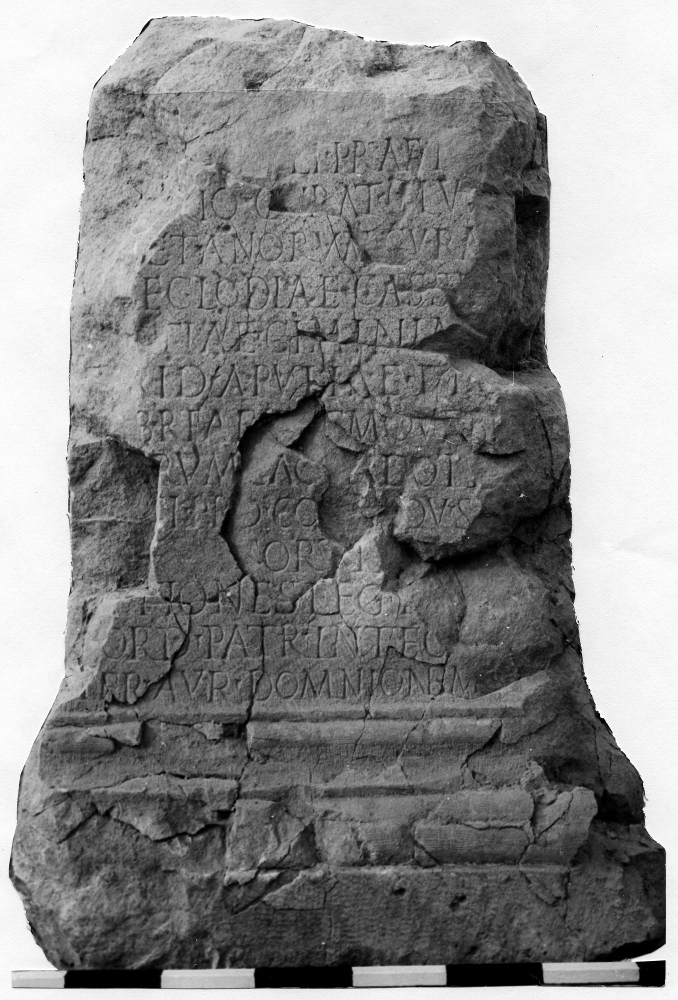
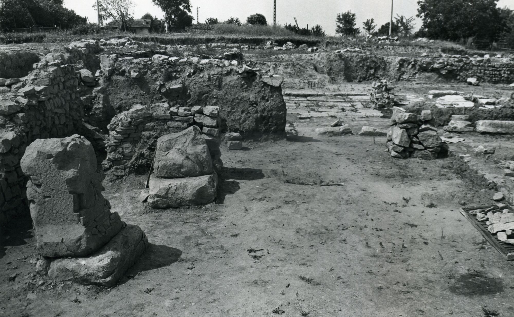

# EDH HD024975. Novae

**Країна.** Болгарія

**Провінція (код EDH).** MoI

**Місце знахідки (антична назва).** Novae

**Сучасна назва.** Svištov

**Деталі знахідки.** Lager,westlich, {Praetorium(?)}, nördlich, Donauufer

**Координати.** 43.614314074,25.391142367

**Рік знахідки.** 1979

**Датування (роки, від'ємні до н. е.).** 238 … 244

**Матеріал.** Gesteine

**Тип пам'ятки.** Statuenbasis

**Розміри (висота, ширина, глибина, см).** -106.0 × 74.0 × 63.0

## Текст (латинь, скорочення розкрито)

```
E[---] / R[---] / EI[---] / N[---] / [--- aedi]li praet[ori tu]/[tela]rio curat(ori) civitat(is) / [Caer]etanorum cura[tori] / [via]e Clodiae Cassi[ae] / [---]tiae Ciminia[e] / [iu]rid(ico) Apuliae et C[a]/[la]briae [it]emque Brut/[tio]rum sac[er]doti [---] / [---]i proco(n)[s(uli) pr]ov(inciae) S[iciliae] / sortit[o] / [o]ptiones leg(ionis) I [Ital(icae)] / Gord(ianae) patr(ono) integ[errimo] / per Aur(elium) Domnionem op(tionem) pr(aetorii)
```

## Текст у вихідному записі

```
E[ ] / R[ ] / EI[ ] / N[ ] / [ ]LI PRAET[ ] / [ ]RIO CVRAT CIVITAT / [ ]ETANORVM CVRA[ ] / [ ]E CLODIAE CASSI[ ] / [ ]TIAE CIMINIA[ ] / [ ]RID APVLIAE ET C[ ] / [ ]BRIAE [ ]EMQVE BRVT / [ ]RVM SAC[ ]DOTI [ ] / [ ]I PROCO[ ]OV S[ ] / SORTIT[ ] / [ ]PTIONES LEG I [ ] / GORD PATR INTEG[ ] / PER AVR DOMNIONEM OP PR
```

## Коментар

(B): Čičikova - Božilova, AE 1990: abweichende Textwiedergabe. Basis aus zahlreichen Fragmenten unvollständig zusammengesetzt.

## Література

AE 1990, 0863. (B)
- IGLN 067; pl. 25, 67 (Fotos u. Zeichnung).
- ILNovae 046; Abb. 46 b; Abb. 46 c (Zeichnung).
- M. Čičikova - V. Božilova, MEFR 102, 1990, 611-619; fig. 3. (B) - AE 1990. #

## Фото





Джерело https://edh.ub.uni-heidelberg.de/edh/inschrift/HD024975, ліцензія CC BY-SA 4.0. Оригінальний XML в архіві сирі_дані/edh_xml.zip
