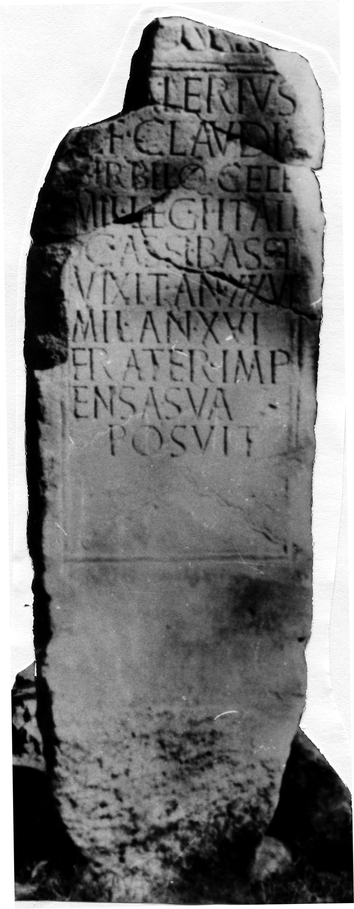

# EDH HD027418. Novae

**Країна.** Болгарія

**Провінція (код EDH).** MoI

**Місце знахідки (антична назва).** Novae

**Сучасна назва.** Svištov

**Координати.** 43.613863548,25.392419099

**Зберігання.** Sofija, Nac. Arh. Muz.

**Датування (роки, від'ємні до н. е.).** 71 … 130

**Матеріал.** Kalkstein

**Тип пам'ятки.** Stele

**Розміри (висота, ширина, глибина, см).** -175.0 × 59.0 × 33.0

## Текст (латинь, скорочення розкрито)

```
[--- V]alerius / L(uci)(?) f(iius) Claudia / Birbilo Cele(ia) / mil(es) leg(ionis) I Ital(icae) / |(centuria) Cassi Bassi / vixit an(nos) XXXVI / mil(itavit) an(nos) XVI / frater imp/ensa sua / posuit
```

## Текст у вихідному записі

```
[ ]ALERIVS / L F CLAVDIA / BIRBILO CELE / MIL LEG I ITAL / | CASSI BASSI / VIXIT AN XXXVI / MIL AN XVI / FRATER IMP / ENSA SVA / POSVIT
```

## Коментар

Unterhalb der Inschrift, noch innerhalb des Inschriftfeldes, Darstellung einer vitis. Zeilenlinien für die Beschriftung. Z. 2: statt L(uci) auch C(ai) möglich.

## Література

S. Conrad, Die Grabstelen aus Moesia inferior. Untersuchungen zu Chronologie, Typologie und Ikonographie (Leipzig 2004) 235, Nr. 405; Taf. 73, 3 u. 75, 2.
- ILBulg 329.
- ILNovae 059; Abb. 59.
- IGLN 085; pl. 31, 85. #

## Фото



Джерело https://edh.ub.uni-heidelberg.de/edh/inschrift/HD027418, ліцензія CC BY-SA 4.0. Оригінальний XML в архіві сирі_дані/edh_xml.zip
