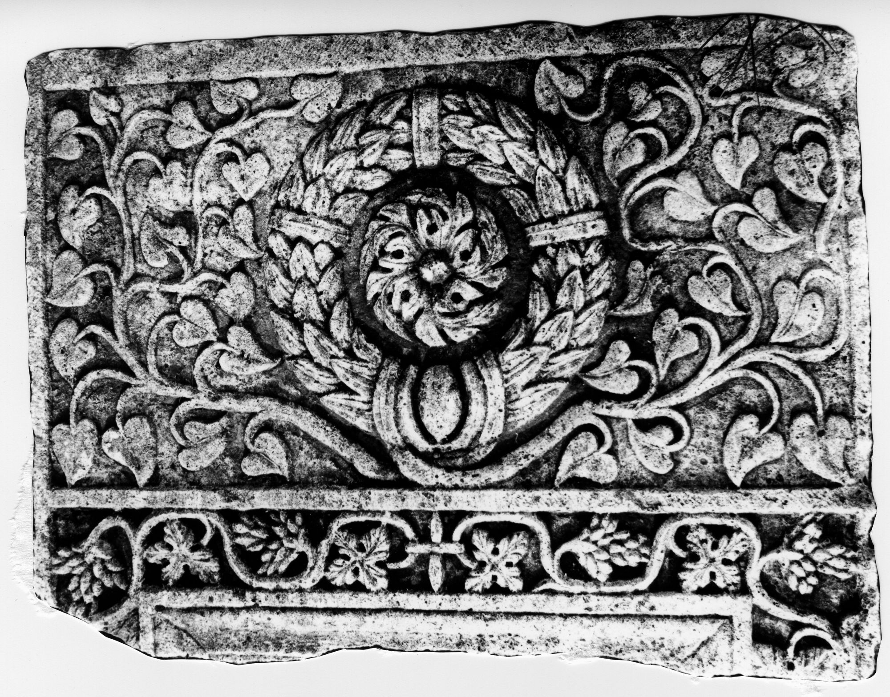

# EDH HD038531. Novae

**Країна.** Болгарія

**Провінція (код EDH).** MoI

**Місце знахідки (антична назва).** Novae

**Сучасна назва.** Svištov

**Деталі знахідки.** {Kalma Češma, Quelle}

**Координати.** 43.606514826,25.417277812

**Рік знахідки.** 1975

**Зберігання.** Novae, Lap.

**Датування (роки, від'ємні до н. е.).** 201 … 250

**Матеріал.** Kalkstein

**Тип пам'ятки.** Stele

**Розміри (висота, ширина, глибина, см).** -95.0 × 131.0 × 30.0

## Текст (латинь, скорочення розкрито)

```
$]/issimae
```

## Текст у вихідному записі

```
] / ISSIMAE
```

## Коментар

Zwei nicht aneinanderpassende Fragmente erhalten; beide Fragmente sind gleich groß: (95) x 131 x 30 cm. Reicher vegetabiler Dekor; oberhalb des Inschriftfeldes ein Kranz.

## Література

S. Conrad, Die Grabstelen aus Moesia inferior. Untersuchungen zu Chronologie, Typologie und Ikonographie (Leipzig 2004) 232, Nr. 394; Taf. 102, 3.
- ILNovae 062; Abb. 62a u. 62b.
- IGLN 112; pl. 38, 112.
- AE 2006, 1203.
- J. Kolendo, Archeologia 57, 2006, 164, Nr. 11. - AE 2006. #

## Фото



Джерело https://edh.ub.uni-heidelberg.de/edh/inschrift/HD038531, ліцензія CC BY-SA 4.0. Оригінальний XML в архіві сирі_дані/edh_xml.zip
