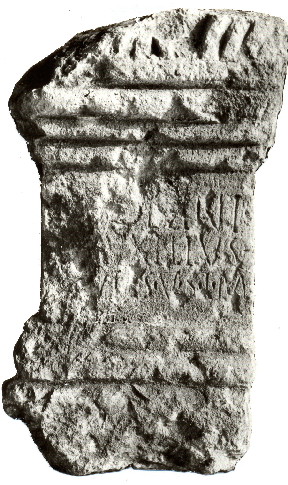

# EDH HD042554. Novae

**Країна.** Болгарія

**Провінція (код EDH).** MoI

**Місце знахідки (антична назва).** Novae

**Сучасна назва.** Svištov

**Деталі знахідки.** Lager, {principia}, nordöstlich

**Координати.** 43.612482817,25.394366380

**Рік знахідки.** 1976

**Датування (роки, від'ємні до н. е.).** 101 … 250

**Матеріал.** Gesteine

**Тип пам'ятки.** Altar

**Розміри (висота, ширина, глибина, см).** -47.0 × -20.0 × -29.0

## Текст (латинь, скорочення розкрито)

```
[Ap]ollini / [-] Auxilius / [---]ut[u]s v(otum) s(olvit) l(ibens) m(erito)
```

## Текст у вихідному записі

```
[ ]OLLINI / [ ] AVXILIVS / [ ]VT[ ]S V S L M
```

## Коментар

(B): Z. 3: Božilova, AE 1994: v(otum) l(ibens) m(erito).

## Література

IGLN 001; pl. 1, 1.
- AE 1994, 1520. (B)
- ILNovae 001; Abb. 1.
- V. Božilova, in: G. Susini (Hrsg.), Limes (Bologna 1994) 119-120, Nr. 1; fig. 1. (B) - AE 1994. #

## Фото



Джерело https://edh.ub.uni-heidelberg.de/edh/inschrift/HD042554, ліцензія CC BY-SA 4.0. Оригінальний XML в архіві сирі_дані/edh_xml.zip
