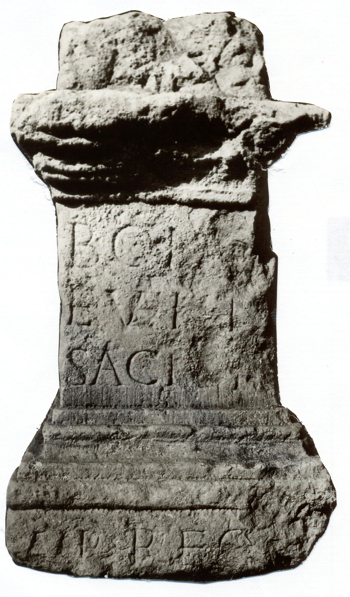

# EDH HD042556. Novae

**Країна.** Болгарія

**Провінція (код EDH).** MoI

**Місце знахідки (антична назва).** Novae

**Сучасна назва.** Svištov

**Координати.** 43.613863548,25.392419099

**Рік знахідки.** 1968

**Зберігання.** Svištov, Ist. Muz.

**Датування (роки, від'ємні до н. е.).** 151 … 250

**Тип пам'ятки.** Statuenbasis

**Розміри (висота, ширина, глибина, см).** 57.0 × 33.0 × 30.5

## Текст (латинь, скорочення розкрито)

```
Bono / Event(ui) / sacrum // Aur(elius) Reg[---]
```

## Текст у вихідному записі

```
BONO / EVENT / SACRVM / / AVR REG[ ]
```

## Література

ILNovae 002; Abb. 2 a u. b.
- IGLN 006; pl. 2, 6.
- AE 1994, 1521.
- V. Božilova, in: G. Susini (Hrsg.), Limes (Bologna 1994) 120-122, Nr. 2; fig. 2. - AE 1994. #

## Фото



Джерело https://edh.ub.uni-heidelberg.de/edh/inschrift/HD042556, ліцензія CC BY-SA 4.0. Оригінальний XML в архіві сирі_дані/edh_xml.zip
