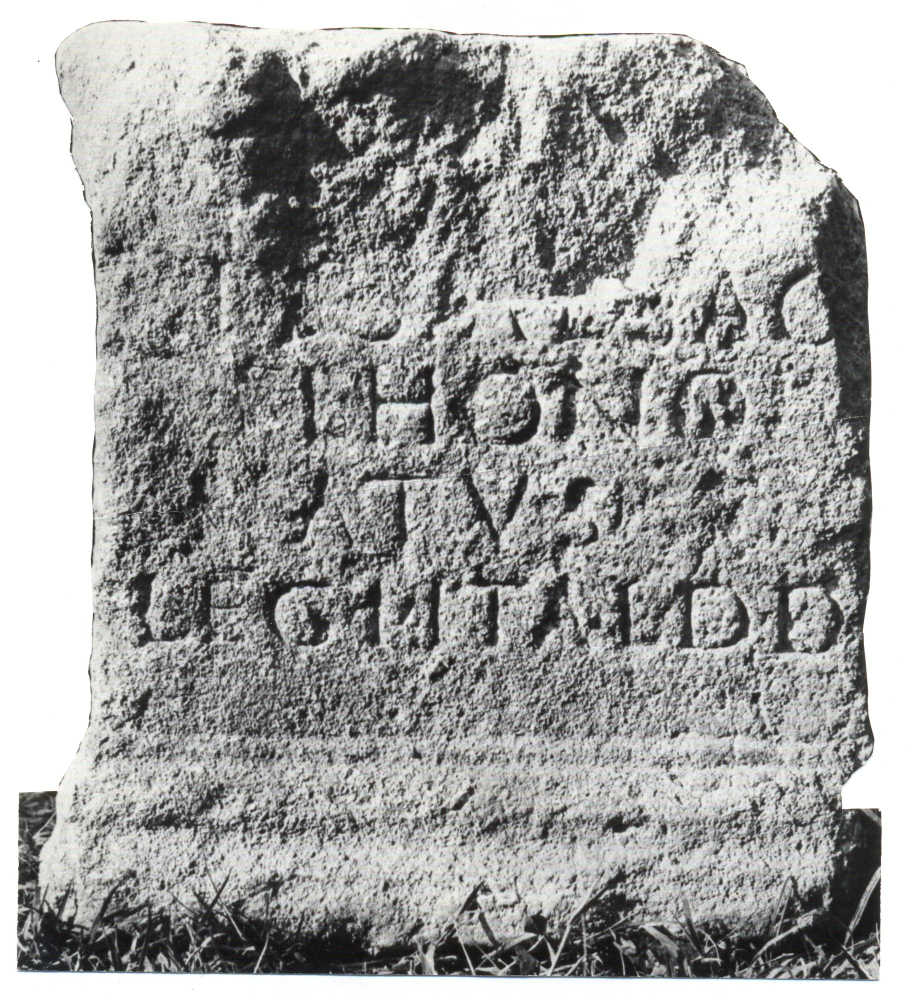

# EDH HD042591. Novae

**Країна.** Болгарія

**Провінція (код EDH).** MoI

**Місце знахідки (антична назва).** Novae

**Сучасна назва.** Svištov

**Деталі знахідки.** Lager, valetudinarium, über, {"Portikusvilla", Raum G}, östliche Mauer, sekundär verwendet

**Координати.** 43.614349189,25.393624242

**Рік знахідки.** 1979

**Датування (роки, від'ємні до н. е.).** 201 … 250

**Матеріал.** Gesteine

**Тип пам'ятки.** Statuenbasis?

**Розміри (висота, ширина, глибина, см).** 33.0 × -31.0 × 33.0

## Текст (латинь, скорочення розкрито)

```
Hygiae sac(rum) / Fl(avius) Hono/ratus |(centurio) / leg(ionis) I Ital(icae) d(onum) d(edit)
```

## Текст у вихідному записі

```
HYGIAE SAC / FL HONO / RATVS | / LEG I ITAL D D
```

## Коментар

Statuenbasis oder Altar? (B): Dyczek - Kolendo: Z. 4: Ita(licae).

## Література

IGLN 017; pl. 7, 17 (Foto u. Zeichnung).
- ILNovae 008; Abb. 8.
- P. Dyczek - J. Kolendo, Archeologia 61, 2010, 40, Nr. 1. (B) #

## Фото



Джерело https://edh.ub.uni-heidelberg.de/edh/inschrift/HD042591, ліцензія CC BY-SA 4.0. Оригінальний XML в архіві сирі_дані/edh_xml.zip
