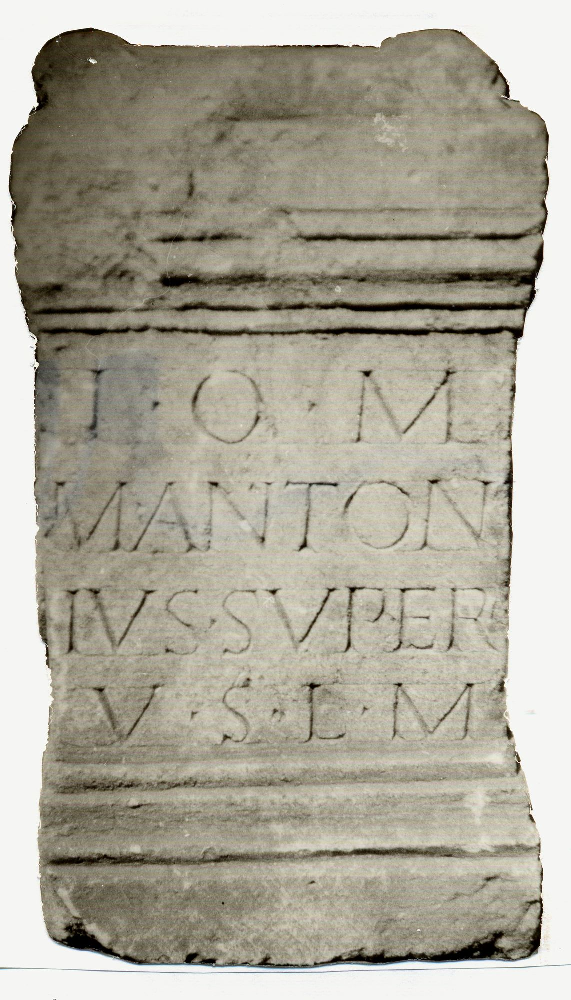

# EDH HD042593. Novae

**Країна.** Болгарія

**Провінція (код EDH).** MoI

**Місце знахідки (антична назва).** Novae

**Сучасна назва.** Svištov

**Деталі знахідки.** {Donauufer}

**Координати.** 43.615424842,25.395433901

**Рік знахідки.** 1982

**Датування (роки, від'ємні до н. е.).** 101 … 200

**Тип пам'ятки.** Altar

**Розміри (висота, ширина, глибина, см).** 58.0 × -35.0 × 22.0

## Текст (латинь, скорочення розкрито)

```
I(ovi) O(ptimo) M(aximo) / M(arcus) Anton/ius Super / v(otum) s(olvit) l(ibens) m(erito)
```

## Текст у вихідному записі

```
I O M / M ANTON / IVS SVPER / V S L M
```

## Література

AE 1994, 1522.
- IGLN 020; pl. 8, 20.
- ILNovae 010; Abb. 10.
- V. Božilova, in: G. Susini (Hrsg.), Limes (Bologna 1994) 122, Nr. 3; fig. 3 a u. b. - AE 1994. #

## Фото



Джерело https://edh.ub.uni-heidelberg.de/edh/inschrift/HD042593, ліцензія CC BY-SA 4.0. Оригінальний XML в архіві сирі_дані/edh_xml.zip
