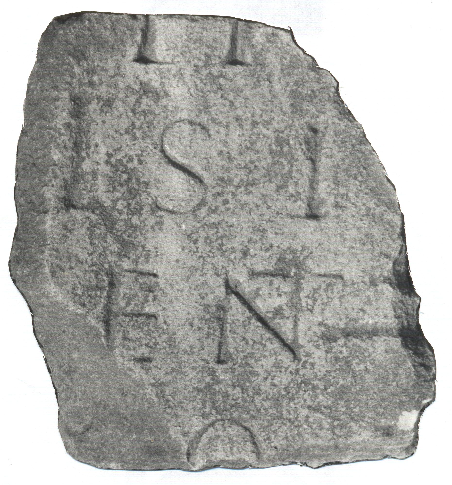

# EDH HD042598. Novae

**Країна.** Болгарія

**Провінція (код EDH).** MoI

**Місце знахідки (антична назва).** Novae

**Сучасна назва.** Svištov

**Деталі знахідки.** Lager, {Bischofsbasilika}

**Координати.** 43.612861502,25.393722651

**Рік знахідки.** 1980

**Зберігання.** Svištov

**Датування (роки, від'ємні до н. е.).** 151 … 250

**Матеріал.** Gesteine

**Тип пам'ятки.** Architekturteil?

**Розміри (висота, ширина, глибина, см).** -35.0 × -33.0 × -34.0

## Текст (латинь, скорочення розкрито)

```
$?] / II(?) [---] / Isi[di? ---] / ENT[---] / O[---] / [&?
```

## Текст у вихідному записі

```
] / II [ ] / ISI[ ] / ENT[ ] / O[ ] / [
```

## Література

ILNovae 016; Abb. 16.
- IGLN 029; pl. 12, 29.
- L. Bricault, Recueil des inscriptions concernant les cultes Isiaques (RICIS) (Paris 2005) 735, Nr. 618/0202; pl. 127, 618/0202. #

## Фото



Джерело https://edh.ub.uni-heidelberg.de/edh/inschrift/HD042598, ліцензія CC BY-SA 4.0. Оригінальний XML в архіві сирі_дані/edh_xml.zip
