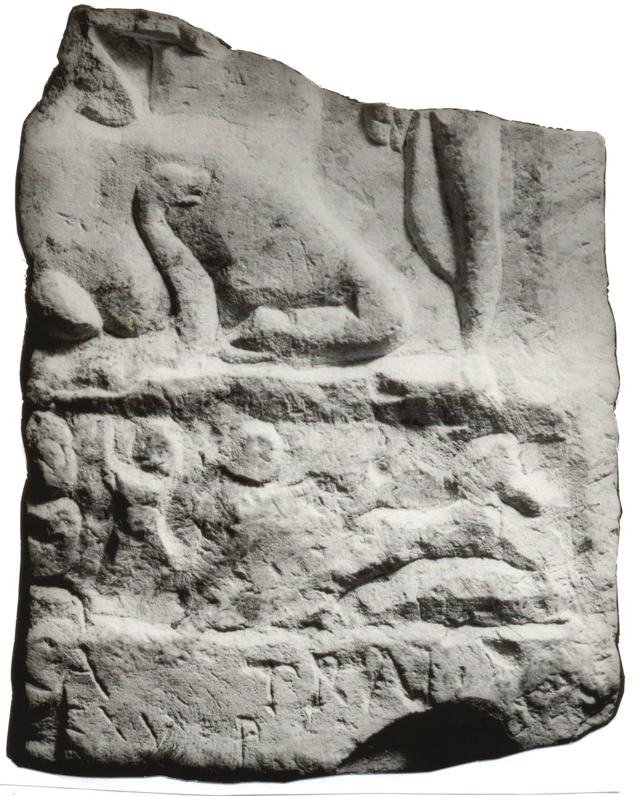

# EDH HD042601. Novae

**Країна.** Болгарія

**Провінція (код EDH).** MoI

**Місце знахідки (антична назва).** Novae

**Сучасна назва.** Svištov

**Деталі знахідки.** Lager, {principia}, nördlich

**Координати.** 43.612482817,25.394366380

**Датування (роки, від'ємні до н. е.).** 151 … 250

**Матеріал.** Gesteine

**Тип пам'ятки.** Relief

**Розміри (висота, ширина, глибина, см).** -19.0 × -15.0 × 43.0

## Текст (латинь, скорочення розкрито)

```
[---? Deo?] Ca[uti? Mi]t(h)rae / ex v(oto) p(osuit)
```

## Текст у вихідному записі

```
[ ] CA[ ]TRAE / EX V P
```

## Коментар

(B): Z. 1: ILNovae: [---]CA TRALV; IGLNovae: [Mu]catralu(s).

## Література

AE 1999, 1329.
- ILNovae 020; Abb. 20. (B)
- IGLN 038; pl. 15, 38. (B)
- V. Najdenova, in: G. von Bülow - A. Milčeva (Hrsg.), Der Limes an der unteren Donau von Diokletian bis Heraklios. Vorträge der Internationalen Konferenz Svištov, 1998 (Sofia 1999) 117-118, Nr. 4. - AE 1999. #

## Фото



Джерело https://edh.ub.uni-heidelberg.de/edh/inschrift/HD042601, ліцензія CC BY-SA 4.0. Оригінальний XML в архіві сирі_дані/edh_xml.zip
