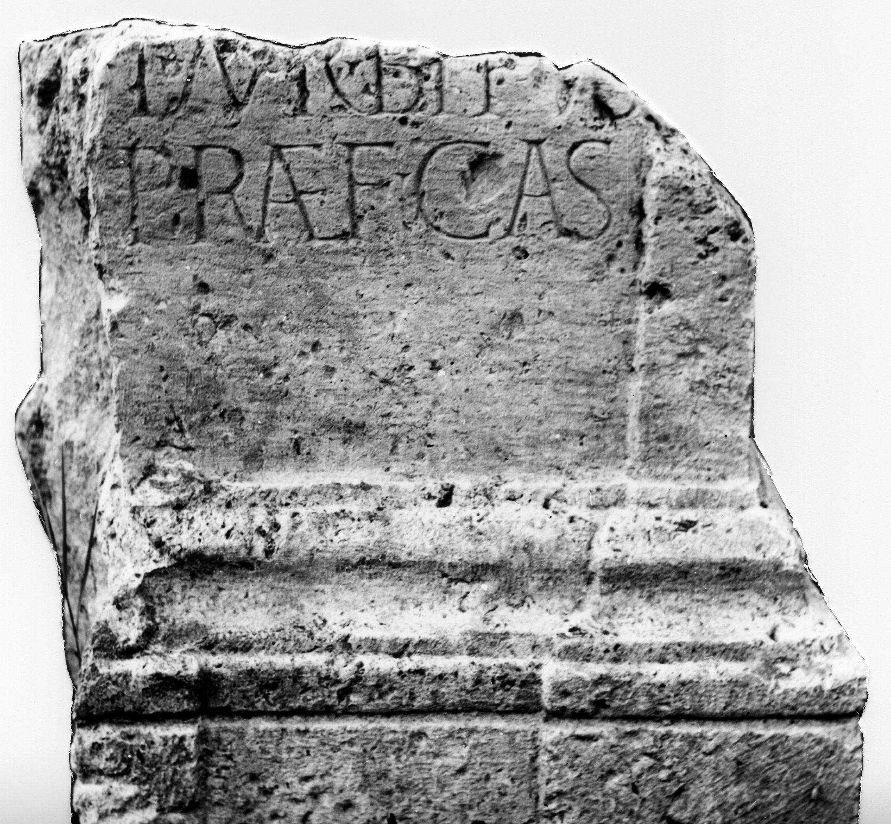

# EDH HD042615. Novae

**Країна.** Болгарія

**Провінція (код EDH).** MoI

**Місце знахідки (антична назва).** Novae

**Сучасна назва.** Svištov

**Деталі знахідки.** Lager, westlich, {moderne Straße}, südlich

**Координати.** 43.613646052,25.389474034

**Рік знахідки.** 1975

**Датування (роки, від'ємні до н. е.).** 201 … 250

**Матеріал.** Gesteine

**Тип пам'ятки.** Altar?

**Розміри (висота, ширина, глибина, см).** -87.0 × -86.0 × 70.0

## Текст (латинь, скорочення розкрито)

```
$] / T(itus) Aur(elius) Bithus / praef(ectus) cas(trorum)
```

## Текст у вихідному записі

```
] / T AVR BITHVS / PRAEF CAS
```

## Література

IGLN 049; pl. 19, 49.
- ILNovae 030; Abb. 30 a u. b. #

## Фото



Джерело https://edh.ub.uni-heidelberg.de/edh/inschrift/HD042615, ліцензія CC BY-SA 4.0. Оригінальний XML в архіві сирі_дані/edh_xml.zip
