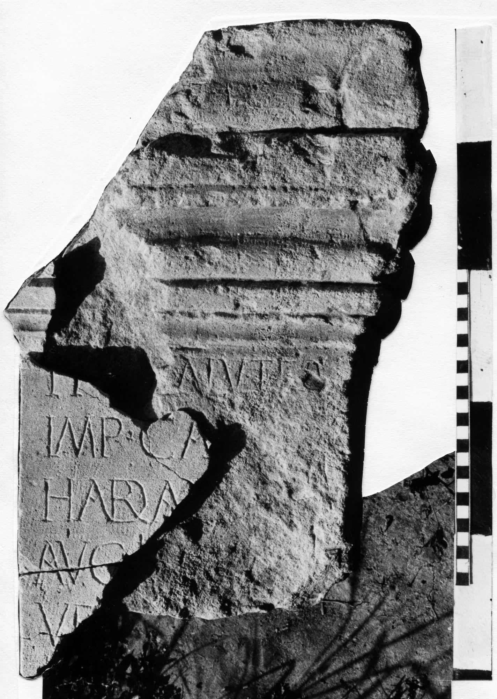

# EDH HD042624. Novae

**Країна.** Болгарія

**Провінція (код EDH).** MoI

**Місце знахідки (антична назва).** Novae

**Сучасна назва.** Svištov

**Деталі знахідки.** Lager, {principia, Basilika}, Plattform, sekundär verwendet

**Координати.** 43.612568265,25.394240317

**Рік знахідки.** 1987

**Датування (роки, від'ємні до н. е.).** 117 … 138

**Матеріал.** Gesteine

**Тип пам'ятки.** Altar

**Розміри (висота, ширина, глибина, см).** -55.0 × 34.0 × 29.0

## Текст (латинь, скорочення розкрито)

```
Pr[o s]alute / Imp(eratoris) Ca[es(aris)] / Hadr(i)a[ni] / Aug(usti) [---] / ve[t(erani?) leg(ionis)] / I [Ital(icae)? ---] / [&?
```

## Текст у вихідному записі

```
PR[ ]ALVTE / IMP CA[ ] / HADRA[ ] / AVG [ ] / VE[ ] / I [ ] / [
```

## Коментар

(B): Kolendo, AE 1991: Z. 5/6: geringfügig abweichende Textwiedergabe.

## Література

AE 1991, 1373. (B)
- ILNovae 035; Abb. 35 a u. b.
- IGLN 054; pl. 21, 54.
- J. Kolendo, Archeologia 40, 1989, 154-156, Nr. 2; ryc. 24-26. (B) - AE 1991.
- AE 1992, 1494. #

## Фото



Джерело https://edh.ub.uni-heidelberg.de/edh/inschrift/HD042624, ліцензія CC BY-SA 4.0. Оригінальний XML в архіві сирі_дані/edh_xml.zip
