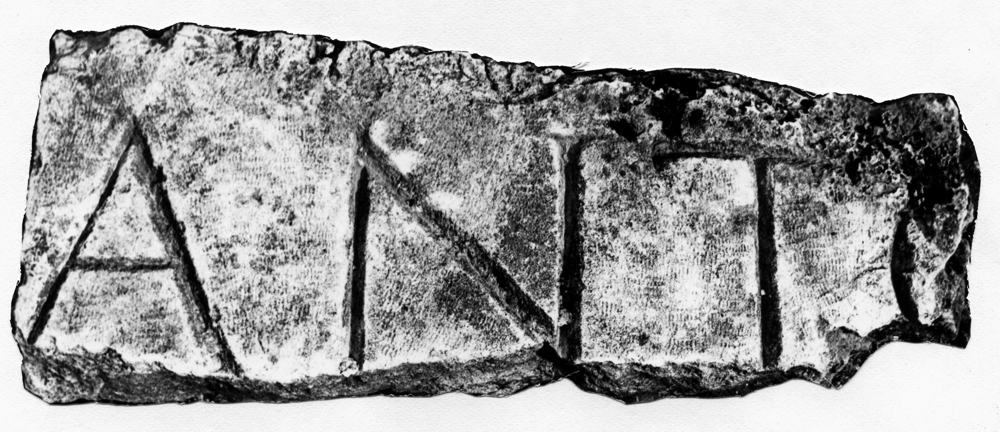

# EDH HD042625. Novae

**Країна.** Болгарія

**Провінція (код EDH).** MoI

**Місце знахідки (антична назва).** Novae

**Сучасна назва.** Svištov

**Деталі знахідки.** Lager, {via praetoria}, westliche Porticus, sekundär verwendet

**Координати.** 43.613677123,25.394607781

**Датування (роки, від'ємні до н. е.).** 138 … 222

**Матеріал.** Gesteine

**Тип пам'ятки.** Architekturteil?

**Розміри (висота, ширина, глибина, см).** -29.0 × -82.0 × -17.0

## Текст (латинь, скорочення розкрито)

```
[---] Anto[nin---]
```

## Текст у вихідному записі

```
[ ] ANTO[ ]
```

## Коментар

Möglicherweise Teil eines Architravs.

## Література

ILNovae 036; Abb. 36.
- IGLN 055; pl. 21, 55. #

## Фото



Джерело https://edh.ub.uni-heidelberg.de/edh/inschrift/HD042625, ліцензія CC BY-SA 4.0. Оригінальний XML в архіві сирі_дані/edh_xml.zip
