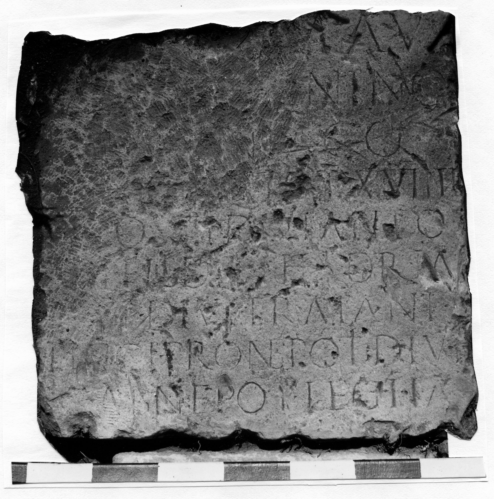

# EDH HD042626. Novae

**Країна.** Болгарія

**Провінція (код EDH).** MoI

**Місце знахідки (антична назва).** Novae

**Сучасна назва.** Svištov

**Деталі знахідки.** Lager, {principia, Innenhof}, sekundär verwendet

**Координати.** 43.613042105,25.394527313

**Рік знахідки.** 1987

**Датування (роки, від'ємні до н. е.).** 164 … 165

**Матеріал.** Gesteine

**Тип пам'ятки.** Statuenbasis?

**Розміри (висота, ширина, глибина, см).** -68.0 × -68.0 × -35.0

## Текст (латинь, скорочення розкрито)

```
Imp(eratori) Caes(ari) M(arco) Au[r]/[elio Anto]nino / [Aug(usto) Arme]n[ia]co / [pont(ifici) max(imo) trib(unicia)] pot(estate) XVIIII / [imp(eratori) II c]o(n)s(uli) III divi Anto/[nini] fil(io) di[vi] Hadria/[ni nepot]i divi Traiani / [Par]thici pronepoti divi / [Nerv]ae abnepot(i) leg(io) I I(t)a(lica)
```

## Текст у вихідному записі

```
IMP CAES M AV[ ] / [ ]NINO / [ ]N[ ]CO / [ ] POT XVIIII / [ ]OS III DIVI ANTO / [ ] FIL DI[ ] HADRIA / [ ]I DIVI TRAIANI / [ ]THICI PRONEPOTI DIVI / [ ]AE ABNEPOT LEG I IA
```

## Література

AE 1991, 1374.
- ILNovae 037; Abb. 37 a; Abb. 37 b (Zeichnung).
- IGLN 056; pl. 21, 56.
- J. Kolendo, Archeologia 40, 1989, 156, Nr. 2; ryc. 27 u. 28. - AE 1991.
- AE 1992, 1494. #

## Фото



Джерело https://edh.ub.uni-heidelberg.de/edh/inschrift/HD042626, ліцензія CC BY-SA 4.0. Оригінальний XML в архіві сирі_дані/edh_xml.zip
