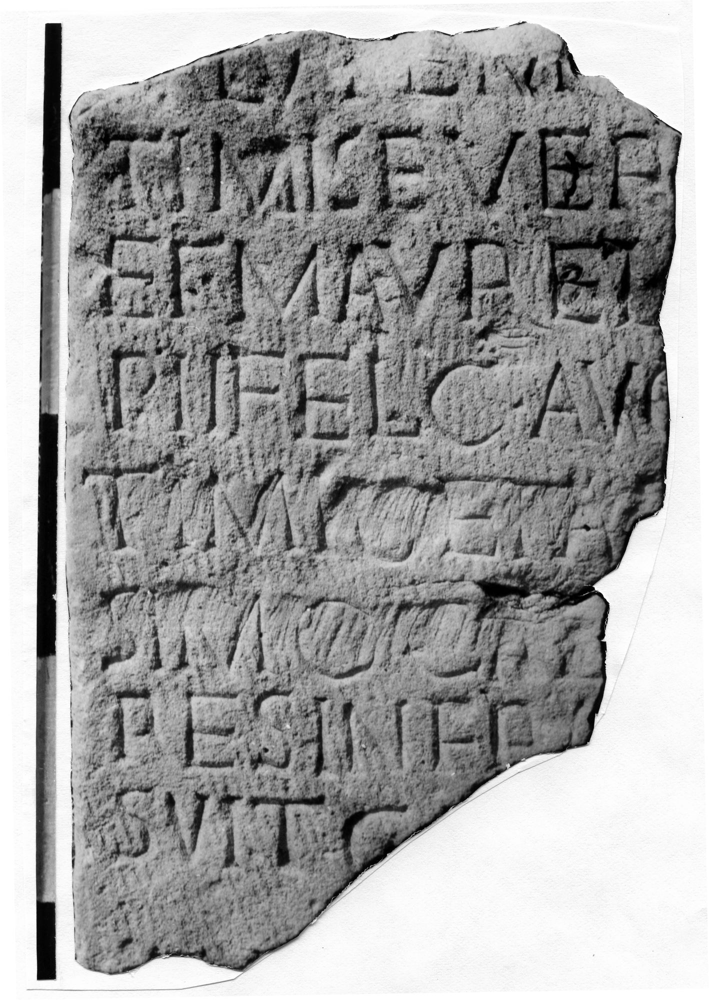

# EDH HD042640. Novae

**Країна.** Болгарія

**Провінція (код EDH).** MoI

**Місце знахідки (антична назва).** Novae

**Сучасна назва.** Svištov

**Деталі знахідки.** {Donauufer}

**Координати.** 43.615424842,25.395433901

**Рік знахідки.** 1987

**Датування (роки, від'ємні до н. е.).** 198 … 209

**Тип пам'ятки.** Architekturteil

**Розміри (висота, ширина, глибина, см).** -36.0 × -23.0 × -29.0

## Текст (латинь, скорочення розкрито)

```
[--- pro] / [s]alute Im[pp(eratorum) L(uci) Sep]/timi Sever[i] / et M(arci) Aurel[i Antonini] / Pii Felic(is) Aug(usti) [et P(ubli) Sep]/[[timi Geta[e nobilis]]]/[[sim<i=O>#nobilis]]]/[[sim<i>#[[SIMO Caes]aris ---]/RES in fr[--- po]/suit C[---]
```

## Текст у вихідному записі

```
[ ] / [ ]ALVTE IM[ ] / TIMI SEVER[ ] / ET M AVREL[ ] / PII FELIC AVG [ ] / [[ [ ]]] / [[ ]] / RES IN FR[ ] / SVIT C[ ]
```

## Коментар

Architrav.

## Література

ILNovae 040; Abb. 40.
- IGLN 061; pl. 23, 61. #

## Фото



Джерело https://edh.ub.uni-heidelberg.de/edh/inschrift/HD042640, ліцензія CC BY-SA 4.0. Оригінальний XML в архіві сирі_дані/edh_xml.zip
