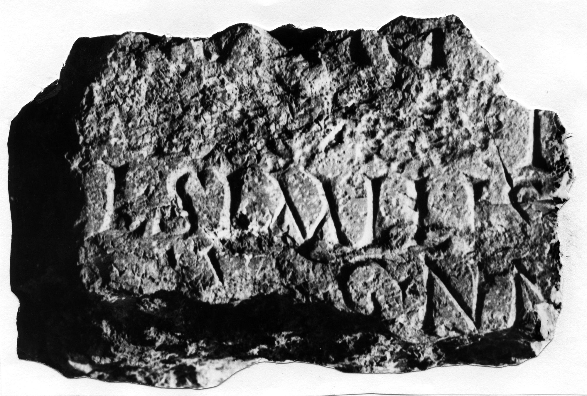

# EDH HD042642. Novae

**Країна.** Болгарія

**Провінція (код EDH).** MoI

**Місце знахідки (антична назва).** Novae

**Сучасна назва.** Svištov

**Деталі знахідки.** Lager, {principia}, nördlich

**Координати.** 43.612482817,25.394366380

**Датування (роки, від'ємні до н. е.).** 198 … 209

**Матеріал.** Gesteine

**Тип пам'ятки.** Statuenbasis?

**Розміри (висота, ширина, глибина, см).** -11.0 × -27.0 × -22.0

## Текст (латинь, скорочення розкрито)

```
$] / [Caesa]ri [---] / [[Getae]] I[---] / [C(aius) Titius] Cl(audia) Similis [---] / [---] Au[g]g(ustorum) nn(ostrorum) [---] / [&
```

## Текст у вихідному записі

```
] / [ ]RI [ ] / [[GETAE]] I[ ] / [ ] CL SIMILIS [ ] / [ ] AV[ ]G NN [ ] / [
```

## Література

ILNovae 042; Abb. 42.
- IGLN 063; pl. 24, 63.
- PIR T 203. #

## Фото



Джерело https://edh.ub.uni-heidelberg.de/edh/inschrift/HD042642, ліцензія CC BY-SA 4.0. Оригінальний XML в архіві сирі_дані/edh_xml.zip
