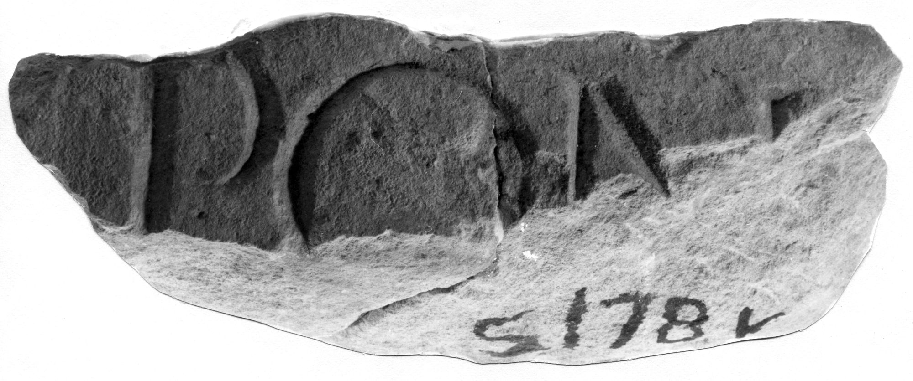

# EDH HD042643. Novae

**Країна.** Болгарія

**Провінція (код EDH).** MoI

**Місце знахідки (антична назва).** Novae

**Сучасна назва.** Svištov

**Деталі знахідки.** Lager, {Bischofsbasilika}

**Координати.** 43.612861502,25.393722651

**Рік знахідки.** 1978

**Датування (роки, від'ємні до н. е.).** 71 … 150

**Матеріал.** Gesteine

**Розміри (висота, ширина, глибина, см).** -25.6 × -18.5 × -6.5

## Текст (латинь, скорочення розкрито)

```
$] pon[t(ifex)? &
```

## Текст у вихідному записі

```
] PON[
```

## Література

ILNovae 044; Abb. 44.
- IGLN 065; pl. 24, 65. #

## Фото



Джерело https://edh.ub.uni-heidelberg.de/edh/inschrift/HD042643, ліцензія CC BY-SA 4.0. Оригінальний XML в архіві сирі_дані/edh_xml.zip
