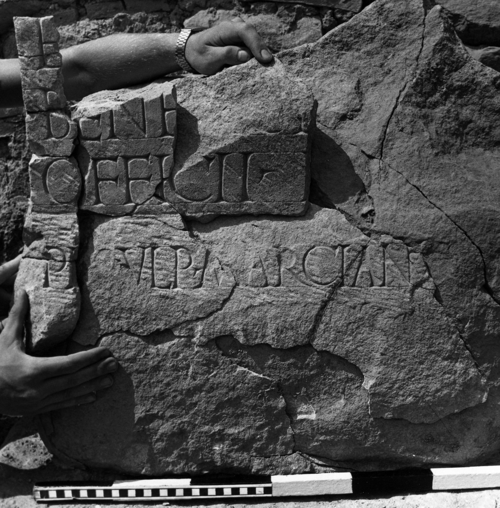

# EDH HD042645. Novae

**Країна.** Болгарія

**Провінція (код EDH).** MoI

**Місце знахідки (антична назва).** Novae

**Сучасна назва.** Svištov

**Деталі знахідки.** Lager,westlich, {Prätorium(?)}, Eingang, bei

**Координати.** 43.614314074,25.391142367

**Рік знахідки.** 1979

**Датування (роки, від'ємні до н. е.).** 222 … 229

**Матеріал.** Gesteine

**Тип пам'ятки.** Statuenbasis

**Розміри (висота, ширина, глибина, см).** -65.0 × -80.0 × -53.0

## Текст (латинь, скорочення розкрито)

```
$] / E[---] / bene[fi]ci[arii] / officii e[ius] / pe[r] Ulp(ium) Marcianu[m ---] // $]AC[---] / [---]FE[---] / [---]TM[& // $]R[& // $]A[---] / [---]S[& // $]I(?)[& // $]ALE[& // $]LIC / [[------]] / [---]RVM / [---]MI / [& // $] / [---]AE[---] / [---]PO[& // $]O / [[------]] / [---]M / [&
```

## Текст у вихідному записі

```
] / E[ ] / BENE[ ]CI[ ] / OFFICII E[ ] / PE[ ] VLP MARCIANV[ ] / / ]AC[ ] / [ ]FE[ ] / [ ]TM[ / / ]R[ / / ]A[ ] / [ ]S[ / / ]I[ / / ]ALE[ / / ]LIC / [[ ]] / [ ]RVM / [ ]MI / [ / / ] / [ ]AE[ ] / [ ]PO[ / / ]O / [[ ]] / [ ]M / [
```

## Коментар

Basis aus 9 Fragmenten unvollständig zusammengesetzt. ALE in Frg. 6 möglicherweise zu legio Italica Alexandrina zu ergänzen.

## Література

ILNovae 047; Abb. 47 a-c; Abb. 47 d-l (Zeichnungen).
- IGLN 068; pl. 26, 68 (Fotos u. Zeichnungen). #

## Фото



Джерело https://edh.ub.uni-heidelberg.de/edh/inschrift/HD042645, ліцензія CC BY-SA 4.0. Оригінальний XML в архіві сирі_дані/edh_xml.zip
