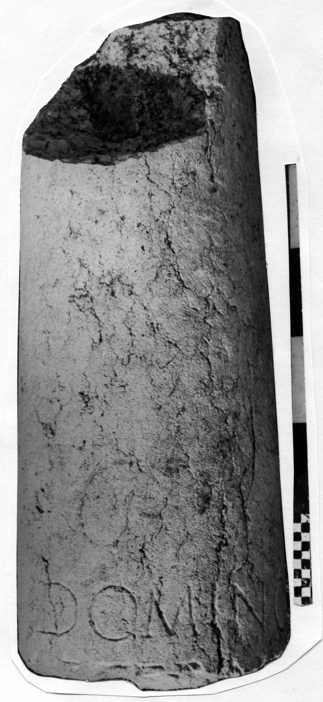
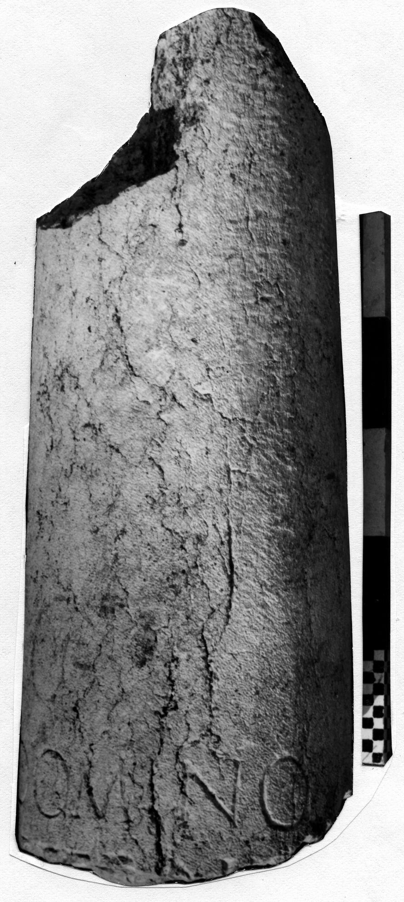

# EDH HD042660. Novae

**Країна.** Болгарія

**Провінція (код EDH).** MoI

**Місце знахідки (антична назва).** Novae

**Сучасна назва.** Svištov

**Деталі знахідки.** {spätantike Erweiterung}

**Координати.** 43.612170160,25.398518441

**Зберігання.** Svištov, Ist. Muz.

**Датування (роки, від'ємні до н. е.).** 1 … 300

**Матеріал.** Kalkstein

**Тип пам'ятки.** EhrenVotivsäule

**Розміри (висота, ширина, глибина, см).** -75.0 × 30.0

## Текст (латинь, скорочення розкрито)

```
Domino / aetern[o] / [&
```

## Текст у вихідному записі

```
DOMINO / AETERN[ ] / [
```

## Коментар

Lesung nach Bartels - Kolb.

## Література

ILNovae 052; Abb. 52 a u. b.
- IGLN 074; pl. 28, 74.
- J. Bartels - A. Kolb, Klio 93, 2011, 411-428; Abb. 1; Abb. 2 (Zeichnung). - AE 2011.
- A. Kolb, in: I miliari lungo le strade dell'Impero. Atti del convegno, Isola della Scala 2009 (Sommacampagna 2011) 22-24; fig. 7 u. 9; fig. 8 (Zeichnung). - AE 2011.
- AE 2011, 1132. #

## Фото





Джерело https://edh.ub.uni-heidelberg.de/edh/inschrift/HD042660, ліцензія CC BY-SA 4.0. Оригінальний XML в архіві сирі_дані/edh_xml.zip
