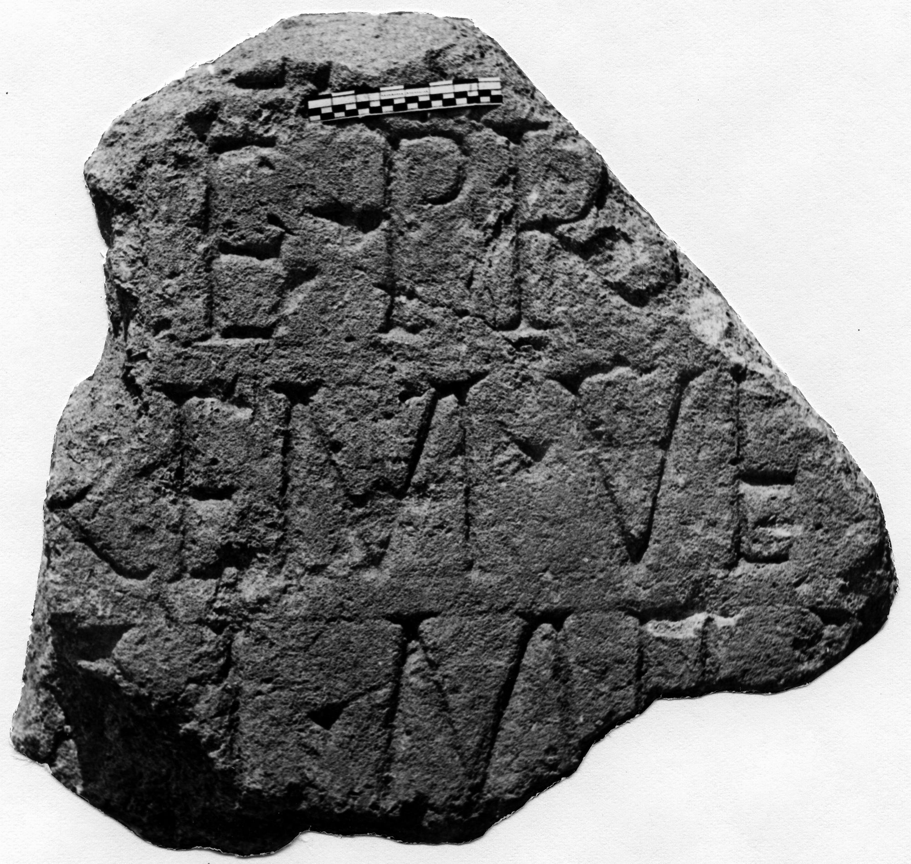

# EDH HD042681. Novae

**Країна.** Болгарія

**Провінція (код EDH).** MoI

**Місце знахідки (антична назва).** Novae

**Сучасна назва.** Svištov

**Деталі знахідки.** Lager, {Südtor}, bei

**Координати.** 43.610643737,25.394151805

**Рік знахідки.** 1974

**Датування (роки, від'ємні до н. е.).** 51 … 150

**Матеріал.** Gesteine

**Тип пам'ятки.** Stele

**Розміри (висота, ширина, глибина, см).** -32.0 × -35.0 × 27.0

## Текст (латинь, скорочення розкрито)

```
$] / [---]G A[---] / [---]IE PR[---] / [---]REM ve[t(eranum)? ---] / [vixit ann(os)] LI mili[tavit ---] / [&
```

## Текст у вихідному записі

```
] / [ ]G A[ ] / [ ]IE PR[ ] / [ ]REM VE[ ] / [ ] LI MILI[ ] / [
```

## Література

IGLN 090; pl. 32, 90.
- ILNovae 063; Abb. 63. #

## Фото



Джерело https://edh.ub.uni-heidelberg.de/edh/inschrift/HD042681, ліцензія CC BY-SA 4.0. Оригінальний XML в архіві сирі_дані/edh_xml.zip
