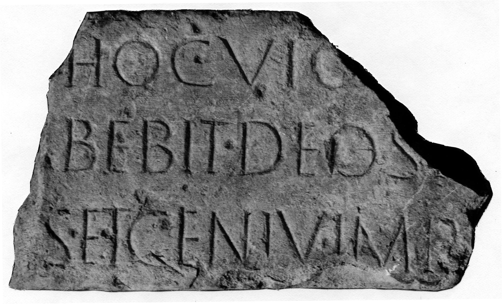

# EDH HD042698. Novae

**Країна.** Болгарія

**Провінція (код EDH).** MoI

**Місце знахідки (антична назва).** Novae

**Сучасна назва.** Svištov

**Деталі знахідки.** Lager, {valetudinarium, Raum 21} über, spätantikes Gebäude, sekundär verwendet

**Координати.** 43.614774308,25.394208132

**Рік знахідки.** 1987

**Датування (роки, від'ємні до н. е.).** 51 … 150

**Матеріал.** Gesteine

**Тип пам'ятки.** Architekturteil

**Розміри (висота, ширина, глибина, см).** 34.0 × -53.0 × 17.0

## Текст (латинь, скорочення розкрито)

```
[Si quis monumentum?] hoc vio[laverit] / [--- h]abebit deos i[ratos] / [---]s et Geniu(m) IMP[&
```

## Текст у вихідному записі

```
[ ] HOC VIO[ ] / [ ]ABEBIT DEOS I[ ] / [ ]S ET GENIV IMP[
```

## Коментар

Architravstück eines Grabbaus.

## Література

AE 1991, 1375.
- IGLN 108; pl. 36, 108.
- ILNovae 065; Abb. 65.
- J. Kolendo, Archeologia 40, 1989, 156-158, Nr. 4; Foto. - AE 1991.
- J. Kolendo, Eos 78, 1990, 377-379; Foto. - AE 1991.
- AE 1992, 1494. #

## Фото



Джерело https://edh.ub.uni-heidelberg.de/edh/inschrift/HD042698, ліцензія CC BY-SA 4.0. Оригінальний XML в архіві сирі_дані/edh_xml.zip
