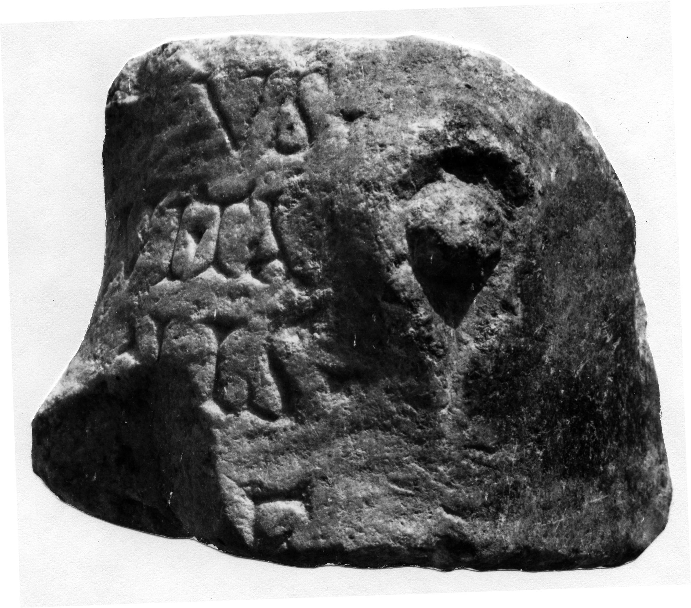
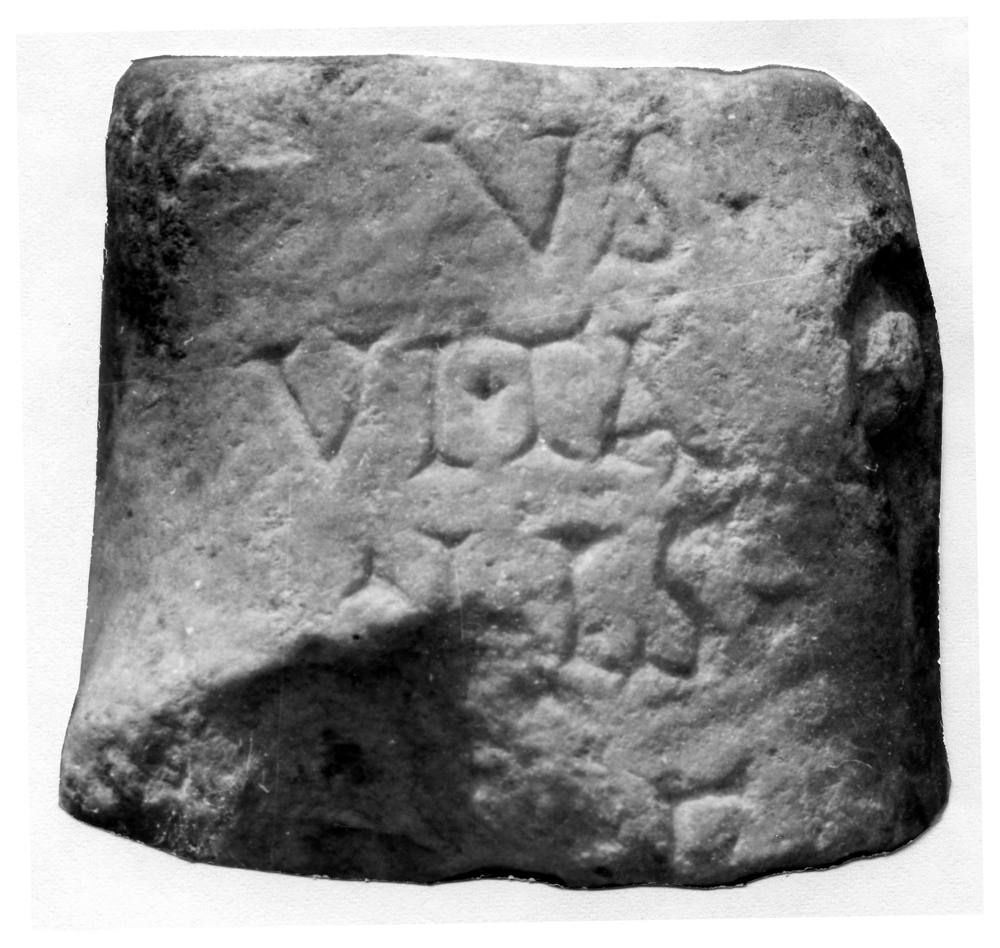

# EDH HD042709. Novae?

**Країна.** Болгарія

**Провінція (код EDH).** MoI

**Місце знахідки (антична назва).** Novae?

**Сучасна назва.** Svištov?

**Координати.** 43.618351,25.350622400

**Зберігання.** Svištov, Ist. Muz.

**Датування (роки, від'ємні до н. е.).** 51 … 250

**Тип пам'ятки.** Statue

**Розміри (висота, ширина, глибина, см).** -10.0 × 11.5 × 11.0

## Текст (латинь, скорочення розкрито)

```
[---]/us / Vita/lis / f(ecit)
```

## Текст у вихідному записі

```
[ ] / VS / VITA / LIS / F
```

## Коментар

Künstlersignatur am Fuß eines Statuenmonuments.

## Література

IGLN 116; pl. 39, 116.
- ILNovae 105; Abb. 105 a u. b. #

## Фото





Джерело https://edh.ub.uni-heidelberg.de/edh/inschrift/HD042709, ліцензія CC BY-SA 4.0. Оригінальний XML в архіві сирі_дані/edh_xml.zip
