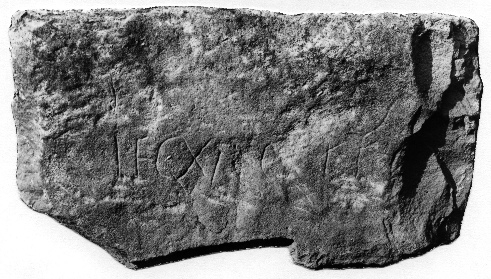

# EDH HD042710. Novae

**Країна.** Болгарія

**Провінція (код EDH).** MoI

**Місце знахідки (антична назва).** Novae

**Сучасна назва.** Svištov

**Деталі знахідки.** spätantike Erweiterung, {Turm 8}

**Координати.** 43.610492258,25.396485326

**Рік знахідки.** 1965

**Датування (роки, від'ємні до н. е.).** 301 … 350

**Матеріал.** Gesteine

**Розміри (висота, ширина, глибина, см).** -23.0 × -44.0

## Текст (латинь, скорочення розкрито)

```
Leg(io) XI Cl(audia) fe[---]
```

## Текст у вихідному записі

```
LEG XI CL FE[ ]
```

## Література

ILNovae 067; Abb. 67 a; Abb. 67 b (Zeichnung).
- IGLN 117; pl. 39, 117 (Foto u. Zeichnung). #

## Фото



Джерело https://edh.ub.uni-heidelberg.de/edh/inschrift/HD042710, ліцензія CC BY-SA 4.0. Оригінальний XML в архіві сирі_дані/edh_xml.zip
