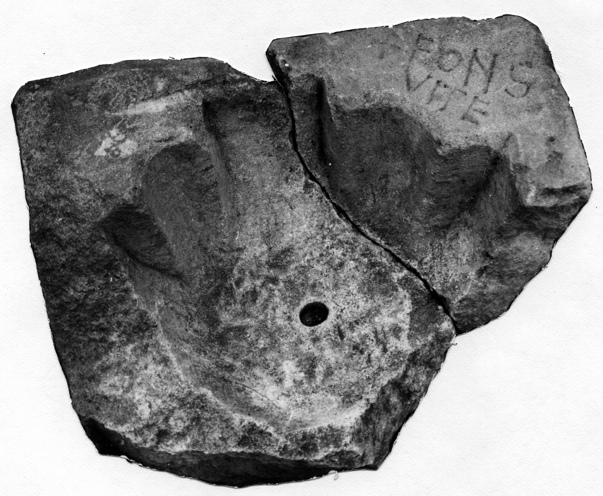

# EDH HD042711. Novae

**Країна.** Болгарія

**Провінція (код EDH).** MoI

**Місце знахідки (антична назва).** Novae

**Сучасна назва.** Svištov

**Деталі знахідки.** {spätantike Erweiterung}

**Координати.** 43.612170160,25.398518441

**Датування (роки, від'ємні до н. е.).** 301 … 400

**Матеріал.** Gesteine

**Тип пам'ятки.** instrsac

**Розміри (висота, ширина, глибина, см).** -32.0 × -54.0 × -40.0

## Текст (латинь, скорочення розкрито)

```
Fons / vit(a)e
```

## Текст у вихідному записі

```
FONS / VITE
```

## Коментар

Taufbecken.

## Література

ILNovae 068; Abb. 68.
- IGLN 118; pl. 39, 118. #

## Фото



Джерело https://edh.ub.uni-heidelberg.de/edh/inschrift/HD042711, ліцензія CC BY-SA 4.0. Оригінальний XML в архіві сирі_дані/edh_xml.zip
