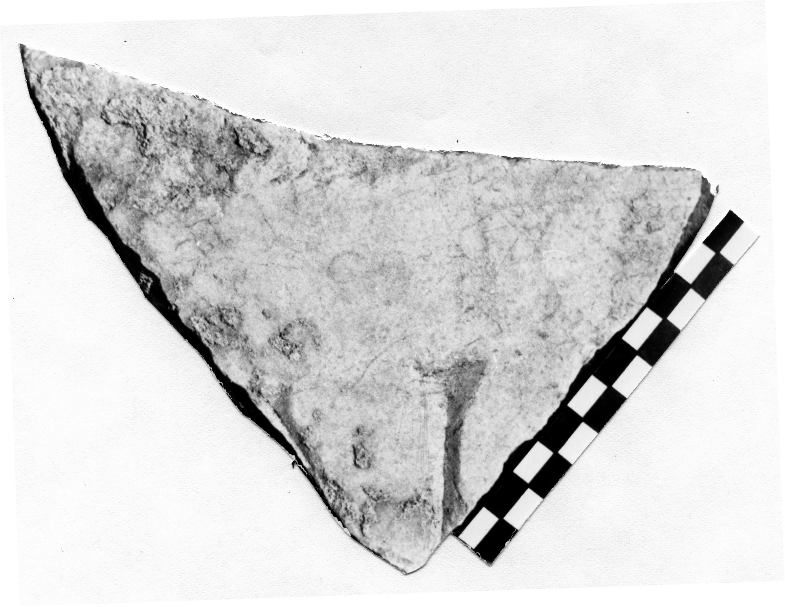

# EDH HD042736. Novae

**Країна.** Болгарія

**Провінція (код EDH).** MoI

**Місце знахідки (антична назва).** Novae

**Сучасна назва.** Svištov

**Деталі знахідки.** Lager, {Bischofsbasilika}

**Координати.** 43.612861502,25.393722651

**Рік знахідки.** 1986

**Датування (роки, від'ємні до н. е.).** 101 … 300

**Матеріал.** Gesteine

**Тип пам'ятки.** Tafel

**Розміри (висота, ширина, глибина, см).** -15.0 × -12.0 × 2.0

## Текст (латинь, скорочення розкрито)

```
[---]IV(?)[&
```

## Текст у вихідному записі

```
[ ]IV[
```

## Література

IGLN 125.
- ILNovae 110; Abb. 110. #

## Фото



Джерело https://edh.ub.uni-heidelberg.de/edh/inschrift/HD042736, ліцензія CC BY-SA 4.0. Оригінальний XML в архіві сирі_дані/edh_xml.zip
