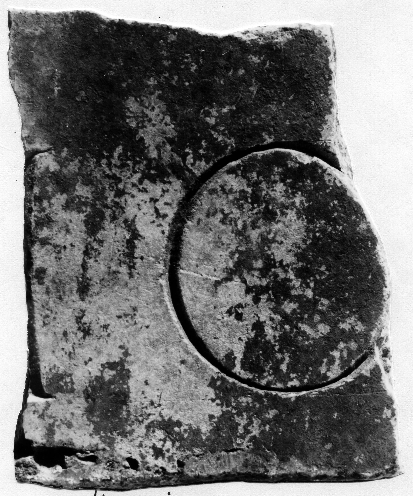

# EDH HD042738. Novae

**Країна.** Болгарія

**Провінція (код EDH).** MoI

**Місце знахідки (антична назва).** Novae

**Сучасна назва.** Svištov

**Деталі знахідки.** Lager, {principia, Südmauer}, unter

**Координати.** 43.612482817,25.394366380

**Рік знахідки.** 1975

**Датування (роки, від'ємні до н. е.).** 51 … 150

**Матеріал.** Gesteine

**Тип пам'ятки.** Tafel

**Розміри (висота, ширина, глибина, см).** -17.5 × -16.0 × 3.0

## Текст (латинь, скорочення розкрито)

```
$]IO[&
```

## Текст у вихідному записі

```
]IO[
```

## Література

IGLN 127; pl. 40, 127.
- ILNovae 074; Abb. 74. #

## Фото



Джерело https://edh.ub.uni-heidelberg.de/edh/inschrift/HD042738, ліцензія CC BY-SA 4.0. Оригінальний XML в архіві сирі_дані/edh_xml.zip
