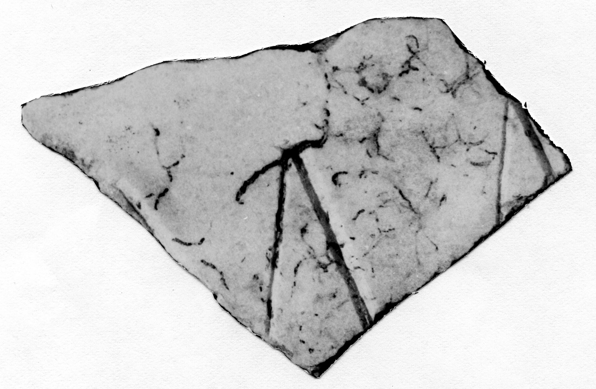

# EDH HD042740. Novae

**Країна.** Болгарія

**Провінція (код EDH).** MoI

**Місце знахідки (антична назва).** Novae

**Сучасна назва.** Svištov

**Деталі знахідки.** Lager, {principia, Raum Fz}

**Координати.** 43.612478934,25.394251046

**Рік знахідки.** 1979

**Датування (роки, від'ємні до н. е.).** 251 … 500

**Матеріал.** Gesteine

**Тип пам'ятки.** Tafel

**Розміри (висота, ширина, глибина, см).** -7.5 × -14.0 × 2.0

## Текст (латинь, скорочення розкрито)

```
$]MA[&
```

## Текст у вихідному записі

```
]MA[
```

## Література

IGLN 128; pl. 40, 128.
- ILNovae 075; Abb. 75. #

## Фото



Джерело https://edh.ub.uni-heidelberg.de/edh/inschrift/HD042740, ліцензія CC BY-SA 4.0. Оригінальний XML в архіві сирі_дані/edh_xml.zip
