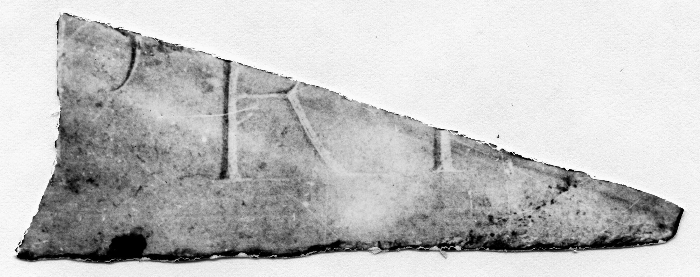

# EDH HD042755. Novae

**Країна.** Болгарія

**Провінція (код EDH).** MoI

**Місце знахідки (антична назва).** Novae

**Сучасна назва.** Svištov

**Деталі знахідки.** Lager, {principia, Raum Fz}

**Координати.** 43.612478934,25.394251046

**Рік знахідки.** 1979

**Датування (роки, від'ємні до н. е.).** 101 … 250

**Матеріал.** Gesteine

**Тип пам'ятки.** Tafel

**Розміри (висота, ширина, глибина, см).** -32.0 × -13.0 × 3.4

## Текст (латинь, скорочення розкрито)

```
$]PRI[&
```

## Текст у вихідному записі

```
]PRI[
```

## Література

ILNovae 079; Abb. 79.
- IGLN 131; pl. 41, 131. #

## Фото



Джерело https://edh.ub.uni-heidelberg.de/edh/inschrift/HD042755, ліцензія CC BY-SA 4.0. Оригінальний XML в архіві сирі_дані/edh_xml.zip
