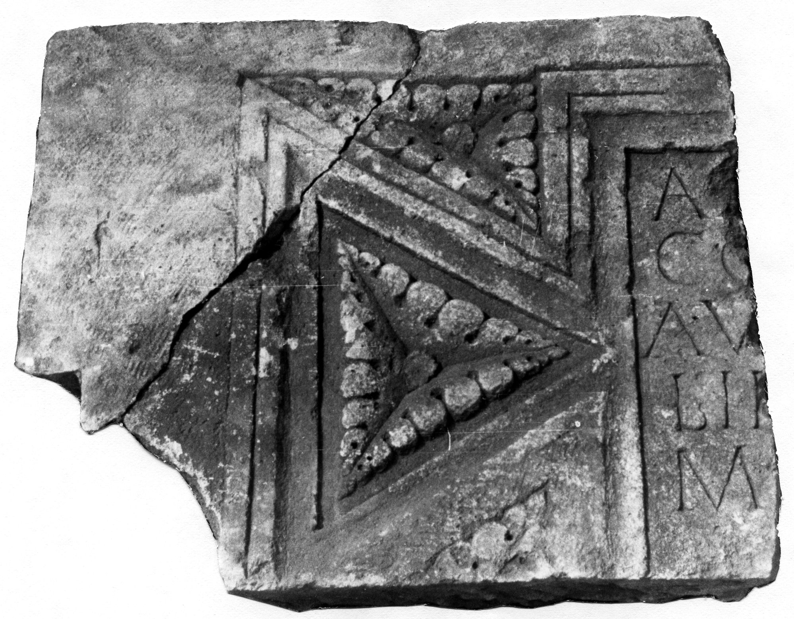

# EDH HD042759. Novae

**Країна.** Болгарія

**Провінція (код EDH).** MoI

**Місце знахідки (антична назва).** Novae

**Сучасна назва.** Svištov

**Деталі знахідки.** Lager, {Bischofsbasilika}

**Координати.** 43.612861502,25.393722651

**Рік знахідки.** 1980

**Датування (роки, від'ємні до н. е.).** 101 … 200

**Матеріал.** Gesteine

**Тип пам'ятки.** Tafel

**Розміри (висота, ширина, глибина, см).** -69.5 × -81.5 × 15.2

## Текст (латинь, скорочення розкрито)

```
A(---)(?) [---] / CO[---] / AV[---] / LII[---] / M[---] / [------?]
```

## Текст у вихідному записі

```
A [ ] / CO[ ] / AV[ ] / LII[ ] / M[ ] / [ ]
```

## Література

ILNovae 083; Abb. 83 a; Abb. 83 b (Zeichnung).
- IGLN 135; pl. 41, 135 (Foto u. Zeichnung). #

## Фото



Джерело https://edh.ub.uni-heidelberg.de/edh/inschrift/HD042759, ліцензія CC BY-SA 4.0. Оригінальний XML в архіві сирі_дані/edh_xml.zip
