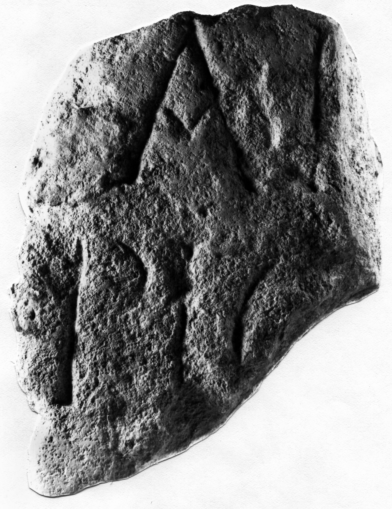

# EDH HD042771. Novae

**Країна.** Болгарія

**Провінція (код EDH).** MoI

**Місце знахідки (антична назва).** Novae

**Сучасна назва.** Svištov

**Деталі знахідки.** Lager, {Bischofsbasilika}, östlich

**Координати.** 43.612861502,25.393722651

**Рік знахідки.** 1978

**Датування (роки, від'ємні до н. е.).** 301 … 600

**Матеріал.** Gesteine

**Тип пам'ятки.** Altar?

**Розміри (висота, ширина, глибина, см).** -24.0 × -20.0 × -14.0

## Текст (латинь, скорочення розкрито)

```
$] / [---]AI[---] / [---]PIO[&
```

## Текст у вихідному записі

```
] / [ ]AI[ ] / [ ]PIO[
```

## Література

ILNovae 085; Abb. 84.
- IGLN 138; pl. 42, 138. #

## Фото



Джерело https://edh.ub.uni-heidelberg.de/edh/inschrift/HD042771, ліцензія CC BY-SA 4.0. Оригінальний XML в архіві сирі_дані/edh_xml.zip
