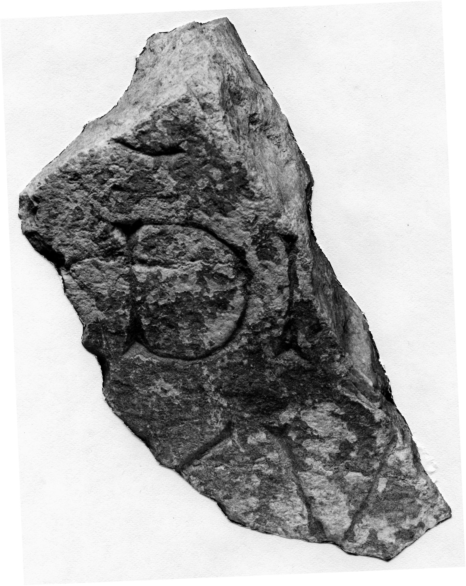

# EDH HD042774. Novae

**Країна.** Болгарія

**Провінція (код EDH).** MoI

**Місце знахідки (антична назва).** Novae

**Сучасна назва.** Svištov

**Деталі знахідки.** Lager, {principia, Innenhof}

**Координати.** 43.613042105,25.394527313

**Рік знахідки.** 1989

**Датування (роки, від'ємні до н. е.).** 101 … 300

**Матеріал.** Gesteine

**Розміри (висота, ширина, глибина, см).** -16.0 × -9.0 × -8.0

## Текст (латинь, скорочення розкрито)

```
$]C[---] /[---]DI[---] / [---]XV[&
```

## Текст у вихідному записі

```
]C[ ] / [ ]DI[ ] / [ ]XV[
```

## Література

ILNovae 114; Abb. 114.
- IGLN 140; pl. 42, 140. #

## Фото



Джерело https://edh.ub.uni-heidelberg.de/edh/inschrift/HD042774, ліцензія CC BY-SA 4.0. Оригінальний XML в архіві сирі_дані/edh_xml.zip
