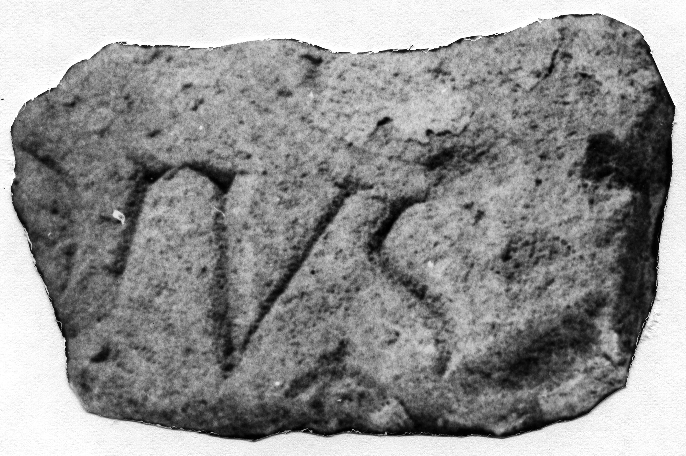

# EDH HD042778. Novae

**Країна.** Болгарія

**Провінція (код EDH).** MoI

**Місце знахідки (антична назва).** Novae

**Сучасна назва.** Svištov

**Деталі знахідки.** spätantike Erweiterung, {Turm 7}, sekundär verwendet

**Координати.** 43.610414577,25.396243928

**Рік знахідки.** 1963

**Датування (роки, від'ємні до н. е.).** 101 … 300

**Матеріал.** Gesteine

**Розміри (висота, ширина, глибина, см).** -7.0 × -10.0 × -4.5

## Текст (латинь, скорочення розкрито)

```
$]DIVS[&
```

## Текст у вихідному записі

```
]DIVS[
```

## Коментар

Nach ILBulg 335 Fragment einer Tafel mit Grabinschrift (ILBulg 335 a, zusammengehörig mit ILBulg 335 b u. c).

## Література

ILNovae 087; Abb. 87.
- IGLN 143; pl. 43, 143.
- ILBulg 335 a. #

## Фото



Джерело https://edh.ub.uni-heidelberg.de/edh/inschrift/HD042778, ліцензія CC BY-SA 4.0. Оригінальний XML в архіві сирі_дані/edh_xml.zip
