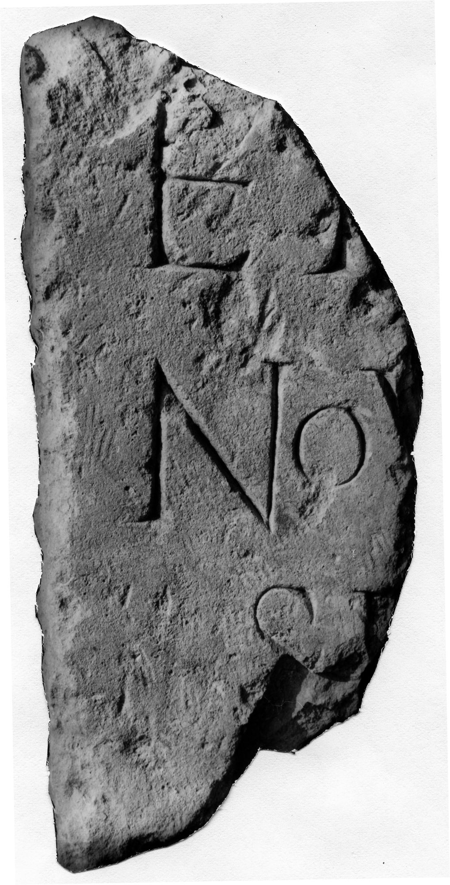

# EDH HD042780. Novae

**Країна.** Болгарія

**Провінція (код EDH).** MoI

**Місце знахідки (антична назва).** Novae

**Сучасна назва.** Svištov

**Деталі знахідки.** spätantike Erweiterung, östliche Mauer, {Nordturm}

**Координати.** 43.614702458,25.398727654

**Рік знахідки.** 1963

**Датування (роки, від'ємні до н. е.).** 101 … 300

**Матеріал.** Gesteine

**Розміри (висота, ширина, глибина, см).** -43.0 × -22.0 × 26.0

## Текст (латинь, скорочення розкрито)

```
$] / EI[---] / NOV[---] / SI[---] / [&
```

## Текст у вихідному записі

```
] / EI[ ] / NOV[ ] / SI[ ] / [
```

## Література

ILNovae 088; Abb. 88.
- IGLN 144; pl. 43, 144. #

## Фото



Джерело https://edh.ub.uni-heidelberg.de/edh/inschrift/HD042780, ліцензія CC BY-SA 4.0. Оригінальний XML в архіві сирі_дані/edh_xml.zip
