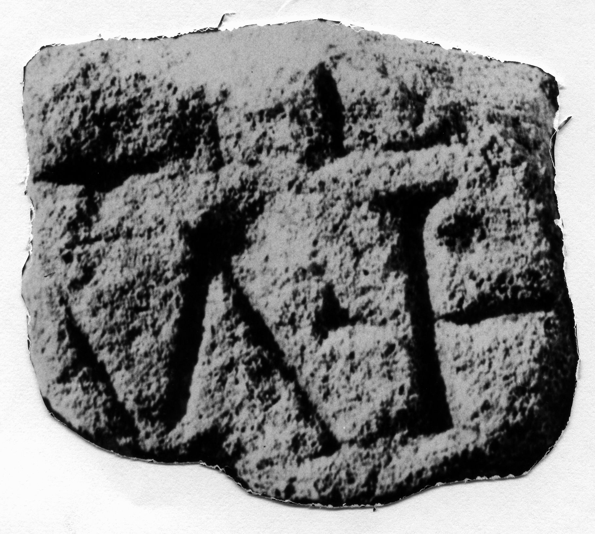

# EDH HD042782. Novae

**Країна.** Болгарія

**Провінція (код EDH).** MoI

**Місце знахідки (антична назва).** Novae

**Сучасна назва.** Svištov

**Деталі знахідки.** {Lager, Nordwestecke}

**Координати.** 43.614997626,25.392462014

**Датування (роки, від'ємні до н. е.).** 51 … 150

**Матеріал.** Gesteine

**Розміри (висота, ширина, глибина, см).** -11.0 × -4.2 × -11.0

## Текст (латинь, скорочення розкрито)

```
$]GL[---] / [---]M H[&
```

## Текст у вихідному записі

```
]GL[ ] / [ ]M H[
```

## Література

ILNovae 089; Abb. 89.
- IGLN 146; pl. 43, 146. #

## Фото



Джерело https://edh.ub.uni-heidelberg.de/edh/inschrift/HD042782, ліцензія CC BY-SA 4.0. Оригінальний XML в архіві сирі_дані/edh_xml.zip
