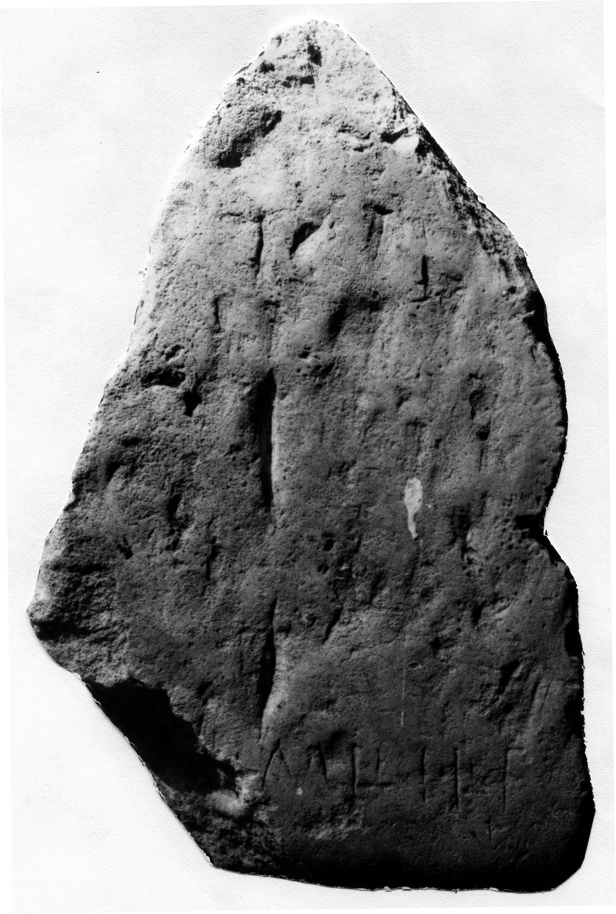

# EDH HD042788. Novae

**Країна.** Болгарія

**Провінція (код EDH).** MoI

**Місце знахідки (антична назва).** Novae

**Сучасна назва.** Svištov

**Деталі знахідки.** Lager, {principia, Raum Bz}

**Координати.** 43.612568265,25.394240317

**Рік знахідки.** 1989

**Датування (роки, від'ємні до н. е.).** 101 … 250

**Матеріал.** Gesteine

**Розміри (висота, ширина, глибина, см).** -35.0 × -21.0 × -18.0

## Текст (латинь, скорочення розкрито)

```
$?] mi(les?) leg(ionis?) I[&?
```

## Текст у вихідному записі

```
] MI LEG I[
```

## Література

ILNovae 115; Abb. 115.
- IGLN 154; pl. 44, 154. #

## Фото



Джерело https://edh.ub.uni-heidelberg.de/edh/inschrift/HD042788, ліцензія CC BY-SA 4.0. Оригінальний XML в архіві сирі_дані/edh_xml.zip
